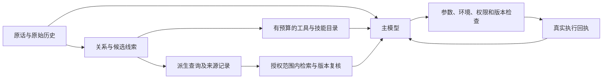

# 任务上下文与检索线索改造

日期：2026-10-09。资料和阅读范围见[一手资料审计](agent-context-source-review-20261009.md)。本文描述当前实现及验证边界。

后续新增留出表达、三轮会话与固定语料测速见[扩展验证](ambiguity-expanded-validation-20261009.md)。新增开放表达仍有失败，本文首轮回归计数不能当作一般歧义准确率。

用户原话提供请求的最后依据；程序派生可追踪的检索提示。主模型结合原话、对话和当前能力选择动作；执行仍通过既有参数、环境、权限与来源版本检查。

## 论文与项目如何用于设计

《Rewrite What Matters》验证多语言推理，没有验证代码检索；总体准确率提高时仍有结果退化和数字丢失。本轮采用原话与派生分离、允许不改写及有限补充，不增加改写模型或默认英文翻译。

ToolChoiceConfusion 的实现依赖已知目标及工具效应图，模拟器忽略参数，不能照搬单工具展示。Canary Tools 支持分开诊断可见性、错选、参数和恢复。SAGE 的参数域信念不是语义正确率或授权，本轮采用先查来源、必要缺口才澄清的指导，没有实现 EVPI。Pi/Cline 源码支持分段组装、按需技能和结果回读，具体来源、Windows 边界及中文关系仍由 KYNXA 合同处理。

追加核查 Codex、OpenHands、SWE-agent、ToolSandbox 作者实现：工具发现及模型选择与执行校验分开；OpenHands 的关键词技能触发只附加知识，ToolSandbox 的标准状态图用于离线评测。Repoformer/Self-RAG 的选择和反思策略依赖专门训练或概率接口。本轮借鉴候选选择、支持度检查及有界补查，没有把普通 API 提示称为复现训练策略；具体来源及全文阅读范围见资料审计。

## 当前流程

`classifyTaskRelation` 返回继续、补充、纠正、换话题、新任务或不确定及继承标志。这是有界工程提示，审计明确 `interpretationVerified: false`，不是通用语义分类器。续问只承接紧邻的已完成用户主题；换题、纠正、当前目标冲突和中间的新主题会阻断旧线索。原始历史保留，任务继承不产生操作授权。

`retrievalPlan` 保存 `originalQuery` 原字串与独立 `query`。`queryDerivation.additions` 记录补充文本、来源、依据和历史消息 ID；`replacements` 记录明确否定、退出及替换的接受与撤销依据。共享 `platform/request-clause-signals.mjs` 保存被取消的早先分句及原文位置，不能明确解析时不猜语义，主模型仍接收完整原话。`clues` 记录候选内容、种类、强弱和来源，仍需证据检验。

自动证据把从当前原话或明确纠正得到的 `retrievalIntent` 单独传给协调器；历史补充中的文件名不能再被解析为当前硬目标。没有任意增加年份、翻译实体或覆盖用户正文。

## 领域与工具候选

`method/function/symbol`、大小写名称和品牌只产生候选。“论文方法”“人际网络”“react 作动词”不因此压到代码或设备网络。自然语言来源词及路径扩展名一律使用 `domain: mixed`，只形成 `preferredDomain`；调用参数显式指定 `domain` 时才保留过滤合同。

Data 验证偏好枚举，词法和融合排序提供有界偏好。代码与知识候选仍参加同一次授权范围内搜索，偏好不改变 scope、不硬排除另一领域、不额外启动一次搜索。路径与符号用于定位候选和排序，真实来源须回读、结构检索核对。仅凭历史代码主题和当前“取消/保存/超时”等技术词不自动检索；主模型可按需调用工具。混合领域使用通用交付验证，软偏好只提供建议角色，不强制代码测试。

工具目录接收本轮关系。继续只承接最近主题；新任务、纠正、换题和不确定任务不借旧工具名决定初始能力。`tool.search/load` 保留发现已配置工具的通道。共同提示说明原话保护、取证、参数缺口和覆盖边界；工具描述写用途、前置条件及少量反例，没有向生产目录加入诱饵。

工具声明和证据按预算排序后交给主模型。排名不执行首项、不认证充分性；模型可选择非首位、回读、发现延后能力或放弃候选。词面缺口也作为候选，先与原始请求核对。明确导航名称匹配已接纳的真实声明结构时，可省去无用向量推理；不是凭名称形状跳过取证。

浏览器复用分句投影，否定操作不产生正向请求；新窗口限制不升级为整个应用禁用。现有接口没有通用动作语义验证能力，复杂窗口/标签限定仍交主模型理解，子句解析器不承诺覆盖任意隐含否定。

运行时短提示只包含关系、候选种类、补充依据及来源 ID，受真实输入预算约束、最多 192 tokens。候选内容和历史补充原文保留在用户/历史位置与本地审计，不能复制进系统字段作为事实，避免复活已撤销的记忆。可选元数据放不下就延后，总预算不增加。本轮没有增加提示词优化 API 调用。

## 根据真实状态恢复

`retrievalOutcome` 记录观察，不证明答案正确：

| 状态 | 下一步 |
|---|---|
| `evidence-found` | 回读并核对支持，索引可能仍部分覆盖 |
| `evidence-already-in-context` | 核查已有上下文，不因去重空结果重搜 |
| `evidence-budget-exhausted` | 使用当前证据或说明上下文上限 |
| `coverage-incomplete` | 查已知来源或索引进度 |
| `source-changed` | 定位并读取当前版本，停止复用旧偏移 |
| `tool-unavailable` | 发现获授权且当前可用的替代能力 |
| `invalid-arguments` | 用当前证据修正参数 |
| `execution-failed` | 先检查失败，再决定恢复 |
| `no-match-in-current-coverage` | 查范围和证据缺口，不断言仓库无资料 |

最终去重、预算缩减和版本复核后的状态同时进入模型请求和保存记录。权限撤销、引用失效与范围变化继续被确定性合同阻止；恢复结果不自动重放修改操作。

会话新增 `RequestInterpretation`、`RetrievalOutcome`、`ContextAssembly` 审计字段。最后一项记录初始可见工具及 token 用量，与后续 `ToolActivities` 的选择、参数错误和执行回执分开，不改变消息正文或授权。

## 验证边界

回归覆盖换题、纠正、软偏好不排除证据、品牌/符号、社交/设备网络、动词/框架、历史目标冲突、派生来源、来源变动、预算用尽、证据去重、记忆撤销和三种协议的小窗口预算。测试使用临时 Data、固定来源和模拟上游，没有消费真实 API；它们验证请求组装及合同，不证明大模型意图准确率或多语言检索收益已提高。

真实模型比较应固定来源、模型和预算，分别替换提示组织、路由或描述，报告展示、选择、参数、执行、恢复和额外调用。关系识别对未覆盖语言及隐含换题仍可能误判；原话、软偏好、发现通道和执行检查限制影响，后续仍需真实模型及 Windows 宿主验收。

### 本次执行结果

- 最终候选与运行时 24 个文件：252/252 通过，日志 `/workspace/onboarding-results/context-candidate-final.log`；包括追加否定/退出反例、自然领域软化、实际索引、会话/记忆及 4K/8K 预算。
- 三协议实际调用回归：模型选择非首位的 `filesystem.read`，只执行该调用，归档和重放正确，3/3 通过；日志 `context-model-choice.log`。模拟模型上游验证机制，不证明语义准确率。
- 固定预算的 10 条新歧义诊断：旧查询解释与当前软偏好方案共享真实解析器与索引，词法每通道 16 候选、Top5、0 API。正确来源进入 Top5 的用例 3/10 → 10/10，Top1 为 3/10 → 9/10；两组无授权泄露，引用通过版本核对和原文回读。比较包括领域及符号解释，不是单变量领域消融；人工数据/标注不能当作一般召回率或答案准确率。见[简报](../../artifacts/retrieval-domain-comparison-2026-10-09.json)与[复跑脚本](../../artifacts/retrieval-domain-comparison.mjs)。
- 首轮相关 129/129、预算复核 44/44 通过，日志 `context-focused-final.log` / `context-budget-final.log`；随后新表达揭示的否定和强领域残留已纳入上述最终回归，首轮通过不代表同类问题全消失。
- 证据协调器审计及运行时：25/26 通过，日志 `context-finalize-tests.log`。失败是已有的 conditional reranking 期望 1 次实际 0 次；同项在改造前基线中失败。新增去重、零预算和来源变化断言通过。
- 最终基础/协调器扩大审计：35/38 通过，日志 `context-candidate-audit.log`。3 个失败仍是上述重排次数旧断言及两项缺 `_planEvidence` 的旧原型测试桩；基线日志有同样失败，没有改动这些断言来凑通过。
- 完整网关套件运行：1,265 通过、57 失败、49 跳过，日志 `context-full-tests.log`。运行包含中间开发状态；其中浏览器提示、会话系统字段、记忆投影、三个查询断言和一个工具候选断言，均在修复后的最终相关测试中通过。此计数不能当作最终版本全绿。
- 原有模型生命周期测试出现 workerData 缺失、超时及未关闭句柄，运行六分钟后仅终止该测试子进程以取得其余结果。首次基线也曾因同文件挂起而终止；本轮没有修改模型生命周期实现或测试。部分新出现的同文件失败在首次日志中尚未执行，不能只凭两个总计归因。
- 其余原有失败涉及 ToolService 不完整测试桩、直接执行 mock 上游 HTTP 500、目录及设置旧断言、重排和原生进程。独立干净 HEAD 验证确认直接执行及电脑审批失败已经存在；没有为通过计数改变权限策略或跳过这些断言。
- `node tools/development/check-architecture.mjs` 通过；`git diff --check` 通过。Linux 环境没有执行 Windows 桌面/原生宿主验证。

计数按各次执行列出，包含重复用例，不相加成独立样本数。改造前全量日志为 `/workspace/onboarding-results/kynxa-gateway-tests.log`。本轮没有提交、推送或发布。
