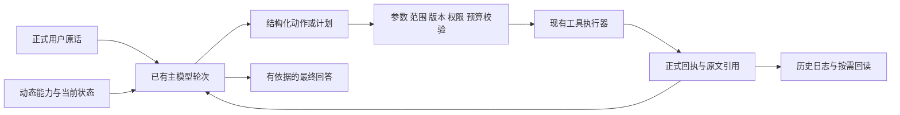

# KYNXA：模型判断与可验证执行的接线记录

核查日期：2026-10-10。实现基线为 main `d6d4008`，本文件描述其后本地后端改动；验证结果以文末本轮记录为准。未修改 B 的桌面界面，未重启活动桌面或网关，未运行付费模型完整基准。

## 职责与正式链路

用户原话始终保留在正式聊天日志。关键词为候选能力排序提供廉价提示；主模型结合原话、历史与真实工具结果判断含义、信息价值和下一次取证方向。程序验证作用域、来源版本、真实状态、参数、预算及执行权限。模型可以修正判断，不能自己认证权限、事实或测试通过。

这里没有独立常驻“提示词优化模型”。工具目录依然由 Tools 管理，检索协调由 Orchestration 管理，原文、记忆和仓储事务由 Data 管理，模型协议和摘要纯合同由 Models 管理。没有新增数据库或另一套执行系统。

## 本轮已接通

### 动态提示与能力发现

- `tool-system-prompt.mjs` 由简短主指导、运行时事实和按预算 Skill 入口组成。事实仅取自代理提供的状态白名单，不将第三方说明当系统权限。
- 目录区分 available/disabled/unavailable、loaded/deferred/selection-pending，以及 MCP ready/disconnected/error；认证未知就明确为 unknown。
- 宿主终端与桌面词法线索只影响初始排序，不再从完整允许目录中删除这些能力。空查询可分页浏览，精确 `tool.load` 可加载未预选工具。
- `knowledge.plan` 与 `memory.*` 标记为 on-demand，保留完整可发现性，减少小窗口里抢占执行 schema 的情况。状态计数描述的是准备时的目录快照；加载后的实际 schema 和回执才是后续调用依据。显式加载预算不足时可延后结果分页 schema，仍保留搜索和加载入口，不提高硬额度。
- 主提示保留明确禁止对象、窗口、执行环境等限制，不能因改用另一工具而降级用户限制。现有权限检查不因模型计划而放宽。

### 可修正的取证与候选工作区

`knowledge.plan` 可以读取或修改本请求的 `meaning/taskRelation/channel/gaps/stop`，以及 `{sourceRef,decision,reason}` 候选。decision 为 investigate/defer/reject，均为模型判断，reject 不会变成检索硬过滤。

原始请求保留；长请求返回其正式消息入口而不重复灌入完整长文本。每个候选须经过授权引用和版本核查；查看候选页时重新核对当前来源。候选检查不等于读完正文，也不证明候选支持结论。新话题清理当前语义候选，不删除历史或执行回执。

更新在私有副本上完成，全部检查与取消校验成功后才发布；取消或失败不消耗工作区 revision。`expectedRevision` 可防旧计划覆盖新状态。计划返回程序给出的作用域、搜索用量、实际剩余证据额度、验证回执和导航后端；指定下一通道只是提议，实际调用仍单独校验。

工作区目前按请求保存于 WeakMap；每次调用结果另外进入正式轨迹。重启后通过原轨迹回读，不声称已经自动恢复整份可变候选工作区。

`knowledge.assess` 新增每项 `semanticSupport`：supports/partial/contradicts/uncertain。程序另行检查原文是否确实读过、引文是否出现、版本是否当前。partial/contradicts/uncertain 不进入 ready 状态。缺省值保持旧调用兼容并标为 not-evaluated；旧 ready 状态仍只是引用检查，不认证语义蕴含。真实测试回执要求保持不变。

### 记忆增改删建议

`memory.read` 分页返回当前聊天、当前工作和用户全局中允许读取的条目、draft/confirmed 状态、范围版本与精确目标身份。query 是词法筛选；空查询浏览全部，已索引确认记忆还可通过 `knowledge.search` 语义检索。分页期间范围版本改变应重新读取。

`memory.propose` 使用 add/update/delete/noop，模型必须记录理由、是否推断及完整正式用户原话。建议只存 draft；模型没有确认工具。更新和删除须绑定已读目标的稳定 ID、范围版本、条目版本及内容来源身份，不仅按向量相似度合并。

用户确认仍走现有记忆 API。新增和旧草稿可保持原确认请求；更新/删除建议还须显式提交匹配的 `proposalAction`。这样旧界面只确认“记忆内容”时不会意外删除或覆盖目标。B 后续可显示动作与差异，再发送该字段；本轮只能通过明确 API 动作确认这两类建议。

来源核查与 CAS 在同一正式仓储保护内进行；确认后通知现有记忆索引链路。丢弃原来源的建议后，原提案重试或同来源换措辞不会复活；新的正式用户消息可以再次提出 draft，不把历史丢弃变成永久内容禁令。

noop 不写文件；候选设置禁用时不保存建议。取消在原子发布前检查；已提交成功的建议返回真实回执，不能被随后取消掩盖。当前来源接受完整正式用户原话；模型的推断不因来源存在而成为正确事实。

### 按需语义摘要与原文回读

`model-semantic-v1`（context.json schema3）保存结构化导航条目、来源消息 ID、覆盖前缀哈希与程序构造的真实工具状态。摘要源含公开阶段文本、配对调用与结果；不包含私有思考或供应商原生续接状态。

仅在实际历史压力下生成计划。有效语义前缀继续复用，小增量先用摘录补足；新增量达到阈值后再尝试一次摘要。模型不能写程序状态；截断、未知结束原因、伪造出处、空内容、未更短、超预算、半检查点或来源变化均拒绝。原文及回执不删除。

摘要生成走已有模型出口和资源准入，禁用业务工具，最多一次请求，最长不超过原模型超时与 120 秒中的较小值。失败使用现有摘录并进入 5 分钟有界冷却；辅助调用的实际派发次数、耗时、输出额度、状态和可得 usage 单独记录在 ContextAssembly.semanticSummary，不能计作用户任务成功。被拒绝摘要仍保存可得 usage；取消前已派发的摘要也保留计数，未知用量不冒充零成本。

摘要外层资源准入与普通回复、流式回复及工具循环共用闲置 CPU/GPU 模型压力回收：首次申请被容量拒绝或等待超时后，确认自有闲置模型清理与预约释放完成，才以原额度重新准入一次。实际摘要已派发后不因失败重放；正在执行或尚未确认退出的模型不提前释放。该接线仅做静态语法和差异检查，未新增运行验收。

提交时在正式聊天锁内重新读取含 ModelTranscript 的历史并检查相同源前缀。准备阶段收到客户端停止信号会关闭摘要请求，不保存半份摘要，不继续正文；正式助手记录为 interrupted。仓储校验不能证明摘要语义完全正确，后续仍需按原文入口取证。

### 工具合同正确性

原参数校验无法正确处理 claims/support 等对象数组，本轮改为自有 JSON schema 的递归检查。顶层和嵌套字段、数量、类型、值域与未知键在派发前检查，constructor/toString/__proto__ 不作为声明属性。外部 MCP schema 仍由原客户端验证。

## 公开实现与论文：借鉴范围

本轮浏览核实下列一手资料；main/master 链接为核查时公开实现，不是固定发行版。没有复制整份提示或源码，也未新增第三方运行依赖。

| 来源 | 借鉴内容 | 本轮边界 |
| --- | --- | --- |
| [Pi system prompt](https://github.com/earendil-works/pi/blob/main/packages/coding-agent/src/core/system-prompt.ts) | 按真实工具、项目与 Skill 组装指导 | Windows 工具名、环境与审批使用 KYNXA 合同 |
| [Cursor 动态上下文发现，2026-01-06](https://cursor.com/blog/dynamic-context-discovery) | 小目录、按需加载、原文回读入口 | 不宣称内部算法完全公开 |
| [Anthropic 上下文工程，2025-09-29](https://www.anthropic.com/engineering/effective-context-engineering-for-ai-agents)及[工具合同](https://www.anthropic.com/engineering/writing-tools-for-agents) | 预加载与按需取证结合，清晰用途与副作用 | 主提示不替代执行权限 |
| [Pi compaction](https://github.com/earendil-works/pi/blob/main/packages/coding-agent/src/core/compaction/compaction.ts)及[DeepSeek Harness](https://github.com/deepseek-ai/deepseek-harness/blob/master/packages/compaction/compaction-basic/README.md) | 先压缩工具观察，再按压力摘要；拒绝不完整检查点 | KYNXA 保留完整轮次，不复制私有 thinking 或声称共享上游 KV 缓存收益 |
| [Mem0，2025](https://arxiv.org/html/2504.19413v1)与[对应四动作公开实现](https://raw.githubusercontent.com/mem0ai/mem0/v0.1.118/mem0/memory/main.py)；[Letta](https://docs.letta.com/v1-sdk/concepts/stateful-agents) | 提炼建议、区分核心与归档记忆、原文回读 | KYNXA 增加用户动作确认、范围、版本、原话核查；当前 Mem0 main 已变更，不能等同该论文版本 |
| [Adaptive-RAG，NAACL 2024](https://arxiv.org/abs/2403.14403)、[Self-RAG，2023](https://arxiv.org/abs/2310.11511) | 按需求决定是否取证，检查证据支持 | 未训练路由器或 reflection tokens，不声称复现训练效果 |
| [Corrective RAG，2024](https://arxiv.org/abs/2401.15884)及[Sufficient Context，2025](https://research.google/pubs/sufficient-context-a-new-lens-on-retrieval-augmented-generation-systems/) | 区分召回不足、支持不足、冲突与错误利用 | 本地空结果不自动将私有查询外发；模型充分性自报不是真值证书 |
| [Beyond One-Shot Expansion，2026-09-07](https://arxiv.org/abs/2609.07050) | 下一次查询由已得到的证据和缺口驱动 | 未把离线对比信息生成设成所有资料的必经步骤 |
| [SemNav，2026-09-25](https://arxiv.org/abs/2609.31176) | 持续修正有依据的代码候选，按需验证关系 | 本轮增加候选工作区；当前后端明确为语法/词法关系，不冒充真实 LSP 调用图 |

## 尚未冒充完成的内容

- 完整语言服务适配、调用图与跨进程语言服务生命周期需要单独实现和验收；当前返回 languageServiceAvailable:false。
- 自动把网页或所有已读文件永久入库没有新增；资料导入继续走现有来源管理，持久事实可由模型提出记忆草稿。模型自主来源入库需要明确存储政策与来源生命周期合同。
- 专门训练的路由/验证模型、常驻监控模型、新向量后端和跨项目自动学习未加入。
- 未做规则/模型/混合三组真实模型任务评分；短测固定模拟响应只证明合同和生命周期，不能报智能准确率或竞品领先。

## 本轮验证

本轮最终运行 36 个受影响 Node 测试文件，486/486 通过，失败/取消/跳过均为 0，耗时 76.46 秒。架构检查无违规，git diff --check 通过。日志与机读结果在仓库忽略的 artifacts/hybrid-agent-decisions/20261010/final-short-regression.log 和 results.json。

初轮 482 项中 5 项小窗口记忆注入失败，原因是通用参考说明占满实际记忆预算；已压缩说明并保持原测试断言，最终整组重新运行通过。不是把此前与本轮部分通过数量累加。

短测使用独立临时数据、模拟凭据和 loopback 模型，没有使用真实聊天或付费 API。验收重点包括：

1. 三协议 8K 窗口仍可发现和加载实际执行工具；陌生词未命中后可浏览全目录。
2. 真实 broker 对象数组评估、反例支持状态、版本失效与可撤回候选。
3. 记忆来源伪造、跨范围、版本冲突、丢弃、稳定分页和显式删除确认。
4. 短聊一次请求、压力时一次摘要加一次正文、下一句仅正文；失败冷却零新增摘要请求。
5. 生成期间编辑/取消不发布摘要，候选检查取消不提交半次 revision，原文日志字节保持不变。

本轮没有修改 B 界面，没有进行整套公开基准或 Windows 安装包验收。正式运行中的进程继续使用启动时版本；源码短测通过不等于活动网关已切换到新实现。
