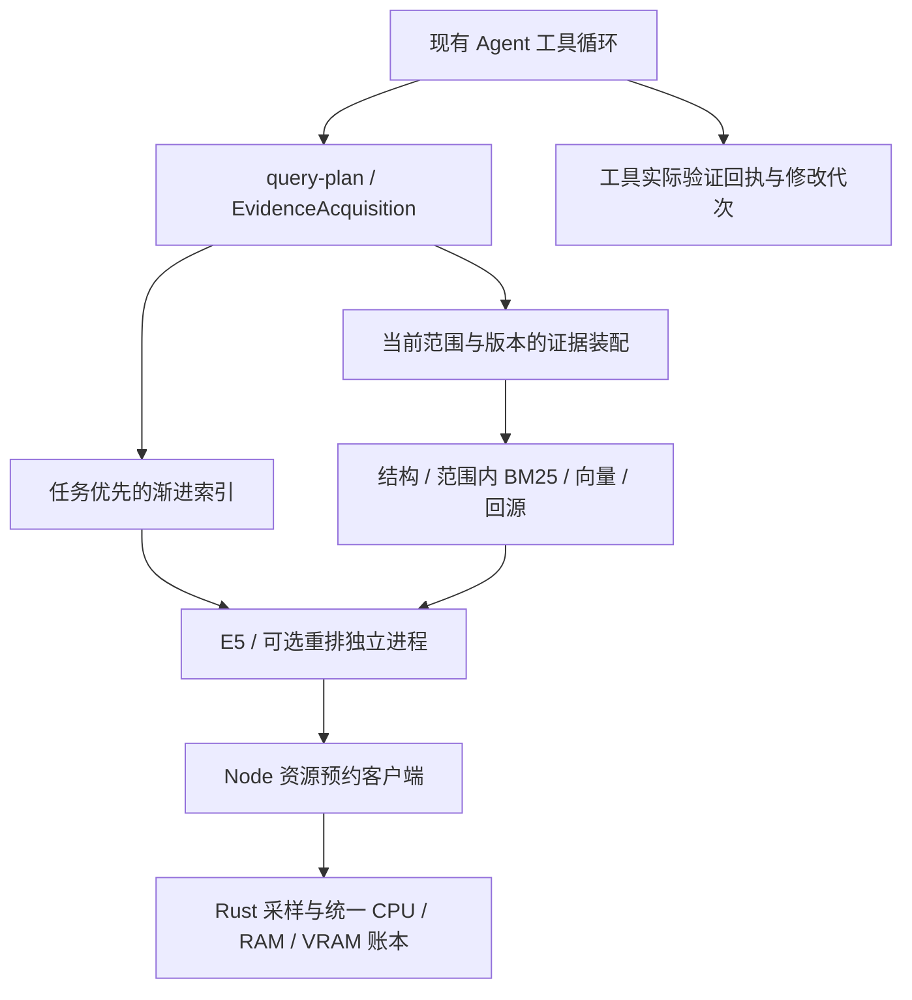

# RAG 问题优化与短测记录

日期：2026-10-08。基线 `1e7062a`。依据用户提供的外部 Linux 评测报告处理具体缺陷；外部原始语料和脚本不在本轮数据集内。按用户要求只做短测，不重跑公开全量检索、十万/百万向量、完整网关、真实模型 Agent 或 Windows 安装器验收。未修改 B 的 UI，也未关闭或重启正在运行的软件/网关。

## 逐项处理

| 外部问题 | 本轮实际修改 | 本轮证据及边界 |
|---|---|---|
| P0 嵌入→重排→再次嵌入导致原生进程崩溃 | 两个模型分别拥有独立 Node 进程，IPC 配对请求；异常退出拒绝待处理调用，超时关闭回收且等待退出，父进程断开有退役看门狗 | 本机真实 E5/BGE 交替成功；模拟子进程崩溃时调用失败但网关存活。没有原 Linux/Node 24.19 环境，未声称原平台已复验 |
| P1 现代 C# 解析兼容 | 固定官方 `tree-sitter-c-sharp@0.23.5` WASM，直接解析原文，grammar 身份进入派生版本 | 集合表达式/spread、主构造、record、泛型、原始字符串、真实 ProjectStore 及坏语法通过短测；桌面 Services 48 个 C# 文件实际重解析全部 parsed |
| P1 路由与目标误判 | 当前问题优先，正式上一用户任务只辅助歧义领域；不继承旧符号或路径；代码/文档不确定时混合查询，自动准备与主动工具走同一规划 | 明确文档和新网页请求不被旧代码任务覆盖；问候、闲聊和纯执行继续跳过检索。未重跑原 100 条问题 |
| P1 最终证据被同文件片段挤占 | 增加路径/真实声明元信息、正文概念、实现/配置/测试角色排序；文件多样性采用软惩罚，精准目标副本在去重前优先 | 同文件 12 段后仍能选到测试/配置，必要同文件证据可超过两段；预算、原始引用和当前来源复核保持 |
| P1 中文定位弱 | 仅在代码/混合查询侧增加有界中英技术概念桥接，同时用于候选相关性；不改原文、来源词频、哈希或引用 | 中文取消/持久化/队列及英文标识符短测通过。这是技术词桥接，不是通用翻译，也不是新的真实语料得分 |
| P1 冷索引与建图阻塞 | 挂载扫描超过 100 ms 前台等待后由受管任务继续；大型冷语料后台派生，未完成发现禁止裁剪来源。大图键集分页建图，每批 256 向量，让出 SQLite 所有者；后台作业结束后预热稳定代次 | 前台保留词法证据和 pending 诊断，不用大型精确扫描掩盖等待；过期代次取消后不能发布。小图保持原查询兼容，首轮全量 CPU 嵌入成本本身没有被消除 |
| P1 实际内存与释放 | 普通 LRU 替换保留磁盘图并退出原生进程，不只撤销 Map 引用；批次/加载后观测 RSS，超预算退出受管 helper；预算收紧取消不兼容构建 | 多次项目切换确认旧 PID 实际不存在。RSS 策略为操作边界检查，阈值是 128 MiB 运行时余量加配置总图预算，不是操作系统硬隔离或长期压力证明 |
| P1 评测可靠性 | 扩展现有 metrics 模块，冻结版本/哈希/查询配对，多来源及字面证据，负例、失败、跳过、诊断和延迟分开记录 | 开发对照检索前保存数据集，回读验证哈希；失败计入分母，跳过不冒充通过。仍需独立人工复核和真实 heldout，不能靠合同标签制造独立性 |
| 嵌入输入超限连带整批丢失 | 根据真实 tokenizer 返回的块位置仅排除超限块，重试同批剩余原始输入 | 合法块保留真实向量，超限块维持 null 与明确诊断，不裁掉原文或伪造向量。完全自适应 token 分块仍是后续能力 |

原始 JSONL、正式记忆、权限范围、来源稳定 ID、绑定版本、原文回读和编辑前版本检查均保留。图存盘前后核验实际代次、数量和图哈希，不能将保存期间变化后的元信息配给旧图。

## 代码与运行组成

- Models：现有嵌入/重排服务及入口，增加 `native-inference-process.mjs` 和 `native-inference-port.mjs` 两个 IPC 生命周期模块，保留调用接口和测试注入。
- Data：现有 ANN 存储与 SQLite 所有者，增加 `ann-build-queue.mjs` 管后台队列、进度及取消；`prepareVectors` 是内部已授权范围接口，不是新增外部命令执行能力。
- Orchestration：沿用规划、选择、来源同步和索引作业；当前用户任务、证据领域与候选意图贯通，后台完成证明可用于后续前台缓存。
- 评测：复用 `tests/retrieval-benchmark/metrics.mjs`，没有另建一套产品 RAG 或统一测试框架。

新 C# grammar 使用官方 MIT 分发，WASM、package.json、LICENSE 按真实桌面打包目标求值均包含。新 IPC 与建图模块沿既有 ESM 源码随包入口提供，用户不用安装 Python、数据库服务或编译 C# grammar。未覆盖正在运行的 AppX，未做新安装器。

## 本轮短测

本机 Windows x64、Node 24.14.0、ORT 1.21.0；全部使用临时 Data、合成/公开来源、本地已存在的固定资产和模拟 API，不调用用户模型 API、不读取真实聊天。独立指标/负例回归不测回答模型。

1. 12 个受影响文件的定向集成短测：**184 通过、0 失败、1 跳过，21.66 秒**。覆盖 ANN、来源发现/取消/恢复、路由/选择、请求上下文、模型生命周期、真实进程隔离、C# 解析与指标合同。跳过是原有较大原生重排验收开关；小样本真实交替已显式运行。
2. 结构 worker 与冻结开发对照：**2/2 通过，约 0.74 秒**。开发夹具为 34 来源、14 查询，包含多来源和无答案，两方法各 completed 14 / failed 0 / skipped 0；这些不是公开基准或竞品得分。
3. 后续小补丁复核：后台建图/预热、大型冷语料、实际 tokenizer 超限隔离 **4/4 通过，约 0.84 秒**，与第 1 项重叠，不重复计数。
4. C# Services 快速静态样本：**48/48 parsed，0 partial/unavailable**；原文不改写，真实错误仍返回 partial。
5. 真实 E5/BGE 小交替：**3 次嵌入、2 次重排、2 个独立进程**；384 维归一化向量交替后保持一致，原生异常退出/取消/超时/父进程断开测试通过。可选重排继续默认关闭。
6. 按真实 MSBuild 目标求值的打包资源检查、架构守卫、语法和差异格式检查通过；未做桌面全编译或覆盖运行包。

不重复计数的测试用例合计 **186 通过、0 失败、1 跳过**。两次初始新测试失败分别是临时目录清理先于自有进程关闭，以及夹具使用了低于既有下限的分块尺寸；夹具修正后转通过，未为测试放宽产品边界。

可复查记录位于忽略提交的 `artifacts/verification/rag-hardening-20261008/`：`short-tests.tap`、`structure-short.tap`、`final-patches.tap`、打包求值和检查摘要。开发对照另保留检索前数据集快照和每个查询的排名、证据、诊断、配对与延迟。

## 仍需独立验收/构建

没有新增真实双语语料成绩，不能宣称报告中的自动路由 83%、最终证据 66% 或中文证据 46% 已达到目标。原 Linux 崩溃平台、长期内存压力、真实大仓库语义质量、单个百万块图、完整跨文件 Agent 修改/构建/恢复任务、Windows 空白机器安装与最终回答忠实度都没有在本轮短测中验收。

Python/Go/Rust 结构语法、LSP 引用/调用图、PDF/DOCX/OCR、通用双语查询改写、完全按模型 tokenizer 自适应分块属于待构建能力；继续保留显式降级，不用文档承诺替代源码。下一次全面验收应固定模型、预算、硬件和独立留出问题，分开报告检索质量、Agent 任务成功率、冷/热延迟与总资源成本。

一手依据：[官方 C# grammar 0.23.5](https://github.com/tree-sitter/tree-sitter-c-sharp/releases/tag/v0.23.5)、[USearch 2.26.4 Node 绑定](https://github.com/unum-cloud/usearch/blob/v2.26.4/javascript/lib.cpp)。本轮没有复制竞品实现或更换产品语言。

## 后续优化：实际 token 分块、更多语法与文档提取

本节为下一轮独立记录，基线 `8b80210`，日期仍为 2026-10-08。上述 186 项是已提交上一轮的证据，不与本节重复累计。继续使用 JavaScript ESM、SQLite、固定 WASM/预编译依赖；不修改 B 的界面，不重启运行中的软件或网关，不运行完整网关、大规模或真实云模型 Agent 评测。

### 已处理的缺陷与新能力

| 项目 | 实现与可观察行为 |
|---|---|
| 超限块永远缺少向量 | Models 增加 `fitDocuments`，使用真实固定 E5 tokenizer 计数，包含 `passage: `、结构标题和特殊 tokens；按原文 UTF-16 连续范围细分，每块不超过 512 tokens，不拆 Unicode 字符、不裁掉正文。测量只加载 tokenizer；推理继续使用独立原生进程 |
| 实际投影与重启不一致 | Data 保存每块实际 context、token 数和拟合版本；派生身份按实际送入模型的正文/上下文计算。SQLite 索引增量升级为 schema 4，保留旧行、稳定 ID、epoch、撤销记录和旧向量；正式配置、资料与作业 schema 仍为 1 |
| 模型故障清掉有效向量且恢复后不拟合 | 不能执行拟合时不保存成功 preparation；只在正式源身份、版本、标题、定位和绑定完全相同且当前来源仍授权时保留旧派生。使用带授权范围的 sourceId 点查，不整库扫描。正文确实变化仍发布新词法并清除旧向量；模型恢复后重试。元信息键顺序不影响身份 |
| 取消旧建图吞掉新请求 | 同键新版本排队等待旧任务实际结束；保存期间取消会清理已挂入缓存的旧 entry，不留下指向已回收原生图的悬空状态 |
| 原生 ANN 崩溃永久不可用 | 有界退避，每分钟最多三次失败尝试；新版本不被旧失败记录永久挡住。查询、保存、失效及原生所有权在短生命周期片段串行，每 256 向量让出所有者；拒绝加载、收紧预算或关闭 ANN 会实际退出自有计算进程 |
| Python/Go/Rust 缺少真实结构 | 沿固定 `@vscode/tree-sitter-wasm@0.3.1` 增加三种实际 grammar，含 Python `.pyi`；支持装饰器/嵌套、Go 接收者/接口、Rust trait/impl/属性等实际声明范围。只做语法定义，不宣称 LSP 引用、编译器解析或宏展开；上游 MIT 通知随包提供 |
| PDF/DOCX 不能导入 | D 工具层使用固定 `pdfjs-dist@6.4.299`、`mammoth@1.13.0` 和 `yauzl@3.4.0` 提取实际文字，输入字节在原路径授权后进入独立隐藏解码进程。只做文本，关闭外部资源联网、PDF 动态字体执行、XFA/图像渲染和 DOCX DTD/实体声明，不生成 HTML、不执行文档脚本 |
| 文档来源与预算遗漏 | 登记快照和增量清单保留原字节哈希、提取版本、PDF 实际页边界，原文件不改动。相同文件状态不能跳过提取规则升级；当前读取再次核验原字节身份。页元信息进入内存/清单预算；模型结果只携带相关页码，不反复发送完整页数组 |
| 可选来源失败打断问答 | 快速文档解析失败或挂载失效时，前台返回 pending 和诊断，不把可选索引故障当作聊天异常；已有来源仍逐项核验，后台显式扫描继续报告失败，不缓存为成功、不裁掉未发现来源。恢复成功清除旧诊断 |

解码预算为原始文件及 UTF-8 提取正文各最多 2 MiB（同时遵循更小的用户源预算）、PDF 最多 100 页、DOCX 最多 512 个 ZIP 项且累计展开最多 16 MiB、最多两个解码进程、单次 10 秒、192 MiB JS heap；操作期间观察 256 MiB RSS 阈值并回收超限进程。RSS 观察与 Node 文件/网络限制不是完整操作系统沙箱。扫描版、混合无文本页 PDF 明确返回 `OCR_UNAVAILABLE`，不把缺页提取记作成功；加密、畸形和超限文档分别报告诊断。当前没有 OCR，也未保证所有文档版式均能可靠提取。

只新增两个有独立职责的拟合模块与三个解码模块；解析、来源、登记、清单、ANN 与协调器沿既有入口扩展，没有新增完整框架、正式数据库或界面文件。Models 管实际分词/推理，Data 管范围与派生身份/持久化，Tools 管已授权字节提取，Orchestration 组合并复核当前来源。用户无需安装 Python 或数据库服务；依赖通过现有 Node 随包入口提供。

### 验收边界

本轮短测只验证上述机制和兼容性；没有重新计算上一报告的自动路由、中文召回或最终证据得分。OCR、LSP 引用/调用图、通用双语改写、独立人工留出集、百万块单图、完整跨文件 Agent 任务、原 Linux 崩溃环境、长期压力和空白 Windows 安装器仍需独立构建或验收，不能因本轮短测通过就宣称全部完成。

### 本轮短测结果

- 14 个受影响测试文件：**173 通过、0 失败、0 跳过，17.47 秒**。包括实际 Windows ANN 子进程故障/取消恢复、七种代码语法、旧 SQLite 增量迁移、来源取消/恢复、模型生命周期和拟合缓存。
- 文档链路：**13 通过、0 失败、0 跳过，4.91 秒**；其中三项已包含于前一组。验证真实离线中文双页 PDF/CMap、DOCX，预算/畸形/无文字页、提取规则升级、取消/超时/PID 回收；实际 DOCX 经过路径读取、正式快照登记、持久后台作业、SQLite 检索与撤销，原字节保持不变。
- 最后来源集成复核 **60/60 通过，9.29 秒**，新增两项覆盖即时坏文档、不存在的挂载、保留来源复核、恢复清理诊断和后台继续诚实失败；其余与第一组重复。最后诊断清理补丁另做这两项定向复核通过。
- 所有组不重复计数合计 **185 项通过、0 失败、0 跳过**。实际 E5 tokenizer 测得两个输入 711、913 tokens，拆成四段并生成真实 384 维向量；另一条真实 SourceIndexer→SQLite→前台刷新→检查点恢复验证两段拟合向量完整保留，不重新解析未变化来源。这些是功能短测，不是语义质量新跑分。
- 按真实 MSBuild 目标求值确认三种新增 grammar、上游通知、解码入口、PDF CMaps/字体及其许可证、Windows canvas 预编译模块、Mammoth/Yauzl 运行入口和许可证随包收录。架构守卫、语法、差异与格式检查通过。仅求值打包，不构建或覆盖运行中的 AppX，不等同于空白机器安装验收。

执行记录保存在忽略提交的 `artifacts/verification/rag-adaptive-20261008/`。本轮未提交或推送；现有软件和网关进程未关闭或重启，新源码尚未被当前运行包加载。

## 后续优化：证据缺口、范围统计与统一资源预约

依据用户新提供的综合方案，在 `8b80210` 及上述未提交改动上继续实施。只做短测，未运行完整测试、公开检索基准、真实云模型 Agent、百万规模、长期压力或安装器验收；B 的 UI 未改，现有网关和软件未重启。

### 已接通的架构

检索层决定工作内容，Rust 只批准资源，现有执行器消费额度；没有第二套正式资料库或 Agent 调度框架。ANN 和解析器继续使用现有有界所有者，尚未全部接入 Rust 预约；外部模型进程也不能仅凭配置地址就冒充已被资源服务管理。

| 问题或目标 | 本轮实现与实际边界 |
|---|---|
| 先工作再完善索引 | 自动上下文准备不启动冷嵌入模型；精确文件/符号候选复核来源后省略向量推理。部分覆盖仍提示已有文件搜索/读取能力；不是让未经授权的扫描绕过索引 |
| 缺口驱动检索 | `planEvidenceAcquisition` 选择词法、结构、向量、章节回读、可选重排或说明未解决缺口；候选报告缺少的实现/测试/配置角色。高相关性、角色出现及读取完成均不宣称语义充分性 |
| 任务驱动的渐进索引 | 前台路径更新优先级，在安全批次边界调整剩余来源；保持实际进度身份、已提交批次和检查点，不恢复用户取消的作业。路径优先列表与缓存有界 |
| 局部证据修复 | 原文、来源、挂载或派生身份变化后，清理依赖该来源的检索缓存/读取观察并返回需重取的引用。尚未建立完整结论依赖图，不把局部引用失效称为完整任务修复 |
| BM25 隔离 | 同一 FTS5 倒排索引内按授权 scope/领域计算 N、平均长度和 DF；无关 scope 插入/删除不改变当前基础排序。独立词法代次避免仅附加向量就反复重算统计；复合标识符按 token 贡献评分，不宣称与原生复合短语评分逐位一致 |
| 路径和分页回执 | 当前工具、自动提示、历史及 `tool.result.read` 共用模型检索投影，清理内部绝对定位字段；完整归档和本地公开查看保留。模型分页先投影再切页，说明 offset 为 UTF-16 单元、hash 仍属于原归档。原文正文和用户指定路径不作泛化替换 |
| 来源/解析恢复 | 引用携带当前派生身份，越界/拆分 Unicode/过期 offset 拒绝并允许重新检索。解析 worker 异常退出允许新请求每分钟最多两次恢复，旧请求不重放，明确取消不恢复。无响应超时尚未确认退出时仍保留容量 |
| 资源统一预约 | 小型 Rust 子进程、私有有界 JSONL；CPU/RAM/GPU 原子申请，过期失联预约隔离保留，Node 故障降级保留已批准总账。离线 E5/重排实际接通，驻留内存与执行 CPU 分开，真正退役后释放 |
| GPU 优先与真实兜底 | Windows NVML 只读显存及利用率采样，NVML UUID→CUDA UUID/LUID→DXGI 设备映射核验；不运行 nvidia-smi/PowerShell 轮询。模型真实推理与 CPU 参考比较通过后才报告 GPU。当前固定 q8 模型在 DirectML 需要 CPU 算子回退，实际使用 CPU，GPU 推理未验收通过 |
| 取消固定低参数 | CPU 和批次使用批准额度与 token/内存预算；按 token 分桶，OOM 最多五次减批，失败 GPU 后端不在每个请求重复加载。冷 token 拟合只申请 tokenizer 内存；真实模型加载申请内存差额。吞吐收益反馈调参仍未实现 |
| 实际任务验证 | `ToolRun.verification` 记录直接测试/构建命令已返回的退出码与文件工具修改代次，后续修改使旧验收不再覆盖。复合命令未分类；通过一个命令不证明完整任务正确。最终报告约束由现有模型流程执行，未新增强制任务完成证书 |
| 随包与主责 | Rust 归 A，模型适配归 C，数据仍归 E，工具投影入口归 D；按真实所有者账号重新生成本地审查规则，未改变远端权限。Release 要求有效资源包；打包白名单只收 exe/原文许可证，有效缓存无需 Rust 工具链 |

这次是工程融合及候选方法实现。任务驱动索引和版本变化驱动局部证据修复已接通；证据收益与资源成本的联合优化目前只有决策/预约接口，没有经过消融或完整任务评测，不能宣称论文收益、原创性或专利成立。

### 实际短测与交付边界

本机 Windows x64，使用临时数据、合成内容、模拟 HTTP/MCP 和本机已有固定离线权重；未调用用户云模型 API。当前不重复计数的 Node 短测 **237 通过、0 失败、2 跳过**，另有 Rust 单元 **4/4** 通过。

- 检索、来源和引用 11 个受影响文件：**151/151 通过，9.37 秒**。
- 连续工具执行、实际回执与计时 3 个文件：**53/53 通过，17.12 秒**；覆盖三协议模拟上游、未声明工具恢复、配对/归档与取消边界。
- 资源、模型适配、拟合及进程 4 个文件：**29 通过、2 跳过，1.71 秒**。跳过为原有较大原生模型显式开关；非 GPU 强制崩溃用的是受控进程/模拟传输，不冒充真实 GPU 崩溃实验。
- 解析恢复定向选择：**4/4 通过，0.54 秒**，包含真实终止解析 worker 后新来源恢复。
- 真实小型自动后端链路：**4.321 秒**完成嵌入、中文查询命中英文合成材料与重排，384 维和向量空间保持。E5/BGE 均明确 GPU 检查失败后使用批准的 CPU 8 线程；后续请求没有再次尝试同一失败 GPU 后端。这是机制验收，不是新语义质量得分。
- Rust Release 可执行文件 **393,216 字节**；设备映射和原子 GPU 预约实际通过。5 秒监控样本工作集约 **42 MiB**，private 约 **31 MiB**，CPU 计数未测到增长但分辨率有限，不推导长期 CPU 上限。
- 按真实 MSBuild 目标求值，资源 exe 及许可证 **54 项**实际进入 `runtime/resource/`，未包含开发工具链或 build.json。架构守卫、语法和差异格式检查通过。这不是完整桌面编译、AppX 发布或空白 Windows 首装验收。

可复查记录在 `artifacts/verification/rag-unified-20261008/`；真实推理与 GPU 失败分类另见 `artifacts/verification/rag-adaptive-resource-20261008/`。初次短测暴露了旧内部重排调用兼容、夹具变化身份/清理顺序和进度合同问题，修正后上述最终短测通过；未为测试跳过来源或模型身份校验。

本节是追加实施前的阶段记录。后续统一预约、反馈、公平准入、实际 GPU、大文件、关系与任务评测的当前结果见下一节，不将本节旧测试数字重复累计。LSP、OCR、外部 Qwen 进程管理及完整质量/平台验收仍需单独明确范围。

## 追加完成：统一执行、预算与独立任务评测

沿用户“后续全部做完”继续接通实现，保留正式来源与既有执行链。没有修改 B 的界面、提交或推送，也没有停止或重启现有网关。本节短测使用独立临时数据；真实 GPU 只使用本机已有固定离线权重，云端模型使用本机模拟 HTTP。

| 机制 | 实际完成与边界 |
|---|---|
| 一份资源权威 | 推理、ANN、结构 worker、文档解码、检索、模型请求、MCP 和本机/沙箱/桌面执行器共用同一预约；Data worker 使用私有 RPC 桥。驻留内存、执行 CPU 和 GPU 分别申请，实际退出后释放，未知退出仍隔离 |
| 反馈、公平与采样 | 有界队列和等待期限、取消、前台优先/后台老化、每四次准入给后台机会；同任务吞吐/延迟历史、五秒保持、压力快速收缩；登记自有 PID/启动身份、RSS 和观测峰值，结束记录有界。短测不保证长期公平或完整瞬时峰值 |
| 取消过低固定预算 | CPU 不再固定两线程、批次不再固定四条；候选与证据分别按任务/资源计算。普通策略 8K、研究 16K、显式证据最多 32K；单请求文档/队列/字节有独立配置和背压。ANN 分片/缓存按真实预约，建图独立 native owner 最多四路，队列 64 |
| 真实 GPU | 两个可选 DirectML q8 profile 实际通过 GPU 算子审计和 CPU 参考比较。E5 800 个 GPU kernel，其中 192 个计算 kernel；CPU 4 个形状 kernel、0 个计算 kernel。旧 CPU 与 GPU 身份分开，失败不能在 GPU 空间偷偷填 CPU 向量。小查询不保证收益，旧配置不被静默迁移 |
| 大文件与覆盖 | 可配置文件/字节容量，文本流式原字节哈希及窗口回读，连续 UTF-16/字节/行偏移。逐来源隔离解析/发布错误，实际词法/语义状态与正式向量复核；部分覆盖持久化为 partial，不把失败来源计作成功，不因一个坏 PDF 阻塞后续文件 |
| 证据修复与经验 | 结论绑定实际回读引文和来源版本，变化后失效相关结论；结构声明/包含/章节与不确定文本引用可按任务导航。经验只保存当前聊天的过程引用并复核版本，不跨聊天泄露或当现成答案。精确引文匹配不证明语义蕴含，图不替代 LSP |
| 连续工作和验证 | 修改代次使旧检查失效；最新失败仍需修复/验证；模型提前给草稿时，最多两次提示必要验证，不重放已成功修改。草稿保持 commentary，真正退出才 final_answer，避免补测后正式聊天保存失败。解析/SQLite worker 可由新调用有界重启，旧失败请求不重放 |
| 独立评测入口 | `evaluate-unified-retrieval.mjs` 和真实 `unified-agent-evaluation-adapter.mjs` 接通 ModelRuntime、正式聊天、SQLite、工具结果与独立 Node 验收。五组使用新副本和同一模型；固定组仍经过真实资源权威的低预算 facade。禁用项在实际目录/协调器拒绝，并非只改实验标签 |

评测分别记录检索 Recall@20、独立任务通过、首次有效工作、准备/检索/模型/总耗时、实际模型轮次、工具次数、token 和重试成本。正常多轮工具循环算一次任务尝试；缺 usage 或任务 GPU 峰值时保留未知。原样本/验收器检查哈希、验收脚本处于模型工作区以外，只支持预先声明的可信 Node 测试。Node 权限不是完整网络操作系统沙箱，不能运行陌生可执行样本。真实留出问题、云模型质量和创新消融收益未在本轮测量。

### 本次短测记录

- 最终检索/Runtime/证据/恢复/验证/消息阶段/评测链路定向组：48/48 通过，13.28 秒。随后新增草稿后验收回归与最新验证状态复核，相关两个文件 12/12 通过，7.30 秒；重叠用例不重复计数。
- 模型资源/大文件/关系/文档提取和 provenance：39/39 通过，11.39 秒。
- 三协议连续工具调用：40/40 通过，32.57 秒，涵盖未声明工具恢复、配对历史、审批、取消和归档。
- Rust 资源策略 8/8、Node 资源/桥 13/13，实际原生资源短测 16 条断言通过。模型服务专用短测 33 通过、3 个显式原生大样本开关跳过。它们是分项验证，不并入上述组以避免重复累计。
- 真实 E5/重排 GPU 证据与随包 DLL 求值在 `rag-adaptive-resource-20261008/`；八条较长文档的短样本 warm GPU 约比 CPU 快 1.7 倍，微小查询更慢。不是完整吞吐/质量基准。
- 原生 ANN/资源/桥与集成追加组 34/34 通过，4.28 秒，含八项已计数的统一检索回归；退出错误、超时和回收保持计算/内存预约到真实退出，替代 helper 重新预约，旧退出事件不读取新 lease。执行器/本机终端回归 21/21 通过，6.33 秒。
- 最后来源批次优化与模型登记/Runtime 回归 44/44 通过，8.30 秒，其中 23 项已计数；小文件实际合并超过四份，未知正文仍保持原子预算。
- 上述最终定向组去除重复后 **196 项通过、0 失败**。独立 Rust、真实 GPU 样本和此前分项记录不叠加计数。没有完整桌面编译、安装器、百万块语义质量、长期压力或真实云 Agent 基准。

资源 Release exe 为 491,520 字节，有效缓存发布只需 exe 与许可证，最终用户不需要 Cargo、Python 或另装数据库。模型 DLL/固定权重沿既有打包白名单；打包求值不等同于空白 Windows 首装验收。

用户后续可先按[评测样例说明](../../tools/development/fixtures/unified-agent/README.md)设置测试模型环境，再执行 smoke。完整测试须补独立 heldout 与代表性任务，同模型/同采样/同预算分组；本轮没有调用用户测试 API，也没有新增对外质量得分。

仍有明确边界：外部已启动 Ollama/Qwen 不由资源服务拥有；关系导航不是完整引用/调用图；无 OCR；传感器只验收 Windows x64 单 NVIDIA 映射；无完整三协议真实云评测、百万规模、长期压力与安装验收。核心架构融合已实现，这些边界不能被“参数放大”或短测数量替代。

## 本轮收尾：Windows 限定与24项核对

本节对应用户提供的 24 项收尾清单，在已有未提交实现上补缺口，不重新建设正式存储、工具执行器或 UI。
交付范围仅 Windows x64；不做 Linux/macOS/ARM64、多 GPU、AMD/Intel 扩展。B 界面不改，Shared
合同可增量扩展；既有用户改动和旧评测数据保留。只做功能短测，不调用测试 API、不跑完整评测。

| 序号 | 实际处理与保留边界 |
|---|---|
| 1 GPU/CPU 空间策略 | `EmbeddingRouter` 按 profile 管会话；`EmbeddingSpacePolicy` 支持 auto/cpu/gpu。只有真实映射、精确 GPU 空间声明和 ready/loading 状态齐备才自动选择；新空间未覆盖当前来源前使用旧 CPU 空间。GPU error 自动退回兼容 CPU，没有则词法；显式 gpu 不伪装 CPU 输出。语义关闭、资产缺失不反复自动排迁移 |
| 2 外部 Ollama/Qwen | 只读 `/api/ps`、`/api/show`，记录是否加载、实际上下文、服务报告大小/显存和 KV 估算/余量；本应用生成状态与全局未知分开。无资源接口的本地 OpenAI 服务仍为未知。观察不启动/卸载/杀用户进程，KV 估算不叠加到可能已包含它的驻留量 |
| 3 平台范围 | 仅 Windows x64 单 NVIDIA physical device 0；DirectML 的 UUID/LUID 映射、真实执行后端与可用显卡分开。未新增其他系统支持，接口 `otherPlatformsSupported:false` |
| 4 旧新评测入口 | 新版本门面复用实际新版 adapter；冻结旧题文、中文配对、种子、模型/协议/预算和评分哈希。结果归一化与独立 run 日志提供 stop/resume 合同，未知执行须宿主结束回执。旧 A/B 定位矩阵需要明确匹配的 legacyRunner；不将旧文件定位率冒充新版修复成功率，不自动重跑或混入旧索引/结果 |
| 5 兑现与重复扣减 | 同轮系统可用 RAM 和登记 PID 的 RSS 增量抵扣已兑现 RAM，按启动身份和首次基线去重；释放后的 allocator 残留不得作新信用。总量硬限、未兑现/未知/隔离保留不取消。尚无每进程 GPU 归属证据，显存仍保留未核验预约，不能宣称 GPU 重复扣减已完全消除 |
| 6 模型需求估算 | 按模型/backend/dtype/序列/token/batch 计算初值，独立 native owner 的工作负载 RSS 增量修正后续预约；有界历史及余量。不接受主网关 RSS 或其他 PID 样本，观测值不是精确权重显存 |
| 7 GPU batch | GPU batch 按显存、主机供数缓冲和 padding/token 预算独立计算；CPU 单线程不再机械限制 GPU 为四条。CPU 分词/供数预约保留，回退时恢复 CPU 批量与设备身份 |
| 8 自适应边界 | task/backend/phase/unit 分组；冷加载、排队与热推理分开，只有可比热样本驱动增长。反馈字段白名单和调整原因沿桥传递，线程/会话重建等待安全边界；有界减批不重建模型 |
| 9 异常租约 | 保留续租、过期隔离和 PID 启动身份。受控 reconcile 在恢复准入前确认旧服务退出、恢复完整账本和核对执行器；worker 退出不自动释放未确认 fork，未知债务继续隔离 |
| 10 范围统计 | 保留已有 ScopedLexicalRanker；补多范围联合、domain 和删除后统计回归。统计身份包含范围及词法代次，不回退到全局 BM25，也不因纯向量发布反复冷扫描 |
| 11 引用与分页 | 沿已有 ev1→当前正式 rag1 映射和模型视图分页；偏移为 UTF-16、行/字节另有明确字段。正文、实际分块/投影、文件窗口和权限变化后旧引用拒绝。模型回读不使用原始归档分页偏移 |
| 12 最终版本核对 | 实际回读和自动证据在最终回答前再次核验当前来源、范围与绑定。仅返回需要回读的来源，最多两次定向修复，草稿保持 commentary；已成功副作用不重放，仍不足时保留回复并说明限制 |
| 13 支持与正确性 | 引文存在、版本当前和完成验收继续分开；`correctnessCertified:false`，缺口/矛盾/推理限制保留。测试通过仍来自本次修改代次的实际执行回执，模型文字不能替代 |
| 14 上下文预算 | 策略/用户上限与剩余输入取小；扣除输出预留、工具 schema、system 和完整历史工具对。finalize 后再次收缩证据；真实工具代理按 FrozenContext 应用余量。剩余零时不再启动索引或嵌入 |
| 15 无收益停止 | 同范围/版本/策略连续普通两次、研究三次无新增有效证据，建议切换符号/路径/关系或回源，不同缺口仍可继续；既有工具观察 guard 最终收束。次数耗尽不自动成功 |
| 16 前台渐进 | 首次 mounted 元信息扫描有 100ms 前台窗口，后续后台推进；大 corpus 准备分批和可取消。未完整发现时不清除未遍历来源，不把缓存 partial 当全仓不存在内容 |
| 17 容量与覆盖 | 既有 `local.indexing` 统一限额继续使用，包含单源/文件/总字节/条目/批次。达到容量时返回已准入前缀、触发维度及未知剩余覆盖；显式导入仍拒绝静默 partial。文档解码保留独立格式安全限额 |
| 18 失败分类 | 按解析/OCR/编码/权限/变化/容量分类；同元信息+提取版本的永久错误不反复解析，瞬时文件读取最多两次，真实变化重试。恢复后清理旧状态/覆盖，坏单文件不阻塞后续来源 |
| 19 派生迁移清理 | SQLite schema 5 增量迁移旧向量，同一当前 chunk 最多两个空间。兼容输入原子发布保留旧空间；正文/嵌入输入变化和删除在事务/外键内清理，当前引用仍校验。现有索引作业按项目合并、ANN 按版本淘汰并等真实 native 退役 |
| 20 当前聊天经验 | 保留原聊天范围，增加 30 天过期和逐记录版本复核；过期、部分、无效状态明确，不自动扩大到跨聊天/工作/全局，不当现成答案 |
| 21 状态/UI | 后端提供配置 profile 与所有实际 profile/backend、资源、空间策略、外部模型和真实作业状态。Shared DTO 保留可选字段/64位字节量，未指定 patch 不发送。B 的实际界面显示尚未接入，本轮不能称 UI 已完成 |
| 22 错误分类 | 准入先于 HTTP 派发，资源原因/503 不被 JSON catch 吞掉；网络、HTTP、响应读取、JSON、空闲/总时限和用户取消分类保留。解析失败只来自实际解码，不暴露上游原错误或凭据 |
| 23 随包能力 | Windows x64 Release 资源 exe 和 54 项许可证/文件哈希已重建核对；构建 remap 删除工作区绝对路径，源/构建脚本指纹变化强制重建。用户不需 Rust/Cargo/Python；缺包明确降级，Release 保持必需检查。未做空白机器安装验收 |
| 24 隐私与执行边界 | 统一 knowledge 模型投影补无引号 Windows/UNC 错误路径及旧内联历史降级；原始归档、正文、引用/网址和正常终端路径保留。原有审批/快照、路径重核、AppContainer 和进程树清理保留，资源服务不充当权限沙箱。本轮不是完整模型出口或宿主危险命令安全认证 |

新增核心职责集中于向量空间持久化、设备选择与模型路由、外部模型观察和评测版本门面；沿既有
index/coordinator/runtime/工具代理组合，未整体迁为 Rust，没有第二份正式权威库或自定义图数据库。
自动选择的索引只改变可重建投影，正式 JSONL、稳定 ID、记忆确认、权限及版本冲突边界保持。

本轮短测原始记录集中在忽略提交的 `artifacts/verification/rag-closeout-20261008/` 与
`rag-closeout-win-20261008/`。它们验证机制和兼容性，不提供新语义质量分数、竞品排名、
百万规模成绩或长时间资源公平性保证。最终集成结果在完成定向验证后追加，不沿用上一节 196 项。

### 本次最终短测

- 15 个受影响网关/评测版本文件，**170 通过、0 失败、0 跳过，12.81 秒**。覆盖真实 SQLite
  双空间保留/升级/失效、当前范围证据与最终回读、前台渐进索引/坏文件、模型请求投影/旧历史、
  native 资源账目/服务恢复、Ollama 只读观察、GPU batch 预算及新版实际五组适配器。
- 三协议真实临时 HTTP 工具回环定向检查，**13 通过、0 失败，16.63 秒**；涵盖最终正文、完整
  工具对、归档回读、Ask 审批、残缺参数不执行、流式阶段修正。不是三协议真实云模型验收。
- 独立 Rust 资源策略 **11/11 通过**；Models 的独立短测 **42 通过、0 失败、3 项显式原生开关
  跳过，3.11 秒**。这些与最终组有重叠，不将各组相加冒充不重复总数或质量评分。
- 共享 DTO/现有客户端 **32 项检查通过**，保留新后端状态、旧 JSON 默认值、partial 覆盖、
  8 GiB 字节量和未指定设置省略；使用模拟 HTTP，不启动桌面或读取正式 Data。
- Windows x64 Release 资源程序 **545,792 字节**；54 个白名单文件/许可证 SHA-256 全部匹配，
  二进制未检出工作区绝对路径。构建成功不等同于新安装包/空白机器验收。
- 架构守卫 **0 违规**；自有改动 ESM 语法、CRLF 及差异检查通过。未改 B 界面，未提交/推送，
  未重启当前应用或网关；当前运行中的旧实例尚未加载本轮源码。

首次并行集成有两项测试首启失败，原始日志保留为 `initial-parallel-fixture-failure.tap`：测试
用 150/500ms 握手期限触发正确 CPU 降级后，仍按 native PID/租约断言恢复。改为先核验真实握手、
有界 5 秒 RPC、主动退出注入失联；交互恢复探针明确使用前台一线程，原隔离/失联/恢复/不清债
断言保留。没有放宽生产超时、硬件额度或未知占用保护，最终相同 15 文件组合全部通过。

GPU 算子和小样本速度记录来自前一节，不当成本轮重新跑分。完整 RAG/Agent 质量基准、长期公平/
峰值压力、真实用户浏览器/终端、安装器及 B 状态界面仍由后续独立验收覆盖。上面的记录对应首轮
收尾，不包含下述后续外部模型准入与 `test` 原程序适配。

### 外部模型准入与原评测程序接线

后续补齐 `external-model-demand.mjs` 与 `orchestration/external-model-admission.mjs`，实际接入
普通/工具、流式/非流式四条生成路径。预约仅覆盖将来分配，不将系统 free memory 已反映的外部
驻留权重重复扣除；未知的既有 GPU 租约仍保留。冷加载服务默认上下文未知时只声明已知权重部分
准入，KV 未知；主机 GPU 暂存仍为观察建议。因此不宣称完全管理 Ollama 权重、KV 或用户进程。
模型序列化大小优先通过只读有界 `/api/tags` 获取，20% 运行余量及 Rust 容量保护保持不变。

自有空闲 GPU 嵌入/重排支持确认退出后让位，并保持下一请求的退役屏障。模型同身份并发共享
预测预约；取消、晚到准入、释放中的新调用、续租被拒及服务降级均有单独状态。完整响应消费后
解除未来分配保护；未知取消结果不能自动释放，确认已加载目标上下文可证明预测已经兑现。

直接修改 `test/agent-benchmark-20261008` 原有脚本：`run-formal30-case.py` 接当前 v3 驱动、独立
输出与源码冻结、当前 schema 5 审计和原生实际 checkpoint。保持原题文、模型、4K/3072/256 预算、
single/autonomous 1/10 上限和定位覆盖率评分；A/B 使用固定 CPU E5 空间，不让自动 GPU 迁移
悄悄改变条件。正式评分目标从 population 的选样记录读取，并以 selected30 公开题集哈希、ID、
commit 和问题哈希校验；评分目标不进入模型输入。这是原运行器适配，不能算新版修复成功率。

启动入口允许覆盖已有 Node/Ollama/模型目录，不下载模型，不改系统环境变量，Ollama 单臂使用
独立随机端口。模型缺失、源码变化、索引缺失/暂停分别留下明确阻塞回执，历史结果和旧 Data 不改。
目前 case 0 缺缓存候选，case 3 `django-11019` 有 3526 个有效文件；旧完整索引不能只换源码哈希
冒充当前索引。短测入口的暂停不能记为 30 题完成或质量得分。

本次真实启动记录保存于 `artifacts/verification/ollama-startup-20261008/`：本机用户环境指向空模型
目录，验证服务只对子进程指定已存在的正确目录。真实当前网关调用 Qwen3:8b，冷加载前通过
Rust 取得约 5.84 GiB 已知权重预约，返回 `READY`、保存 completed、释放后租约数归零；热加载
第二次回复仍为 `READY`，没有再次预约权重，观测运行上下文为 4096。仅用新建独立 Data，未改 B
界面、未停止用户的应用/网关或模型。首次参数估算导致资源拒绝的记录单独保留，不算成功。

五份新增/受影响机制和预算测试最终 **55/55 通过**，涵盖真实临时 HTTP 派发边界、共享取消、
退役屏障、续租隔离、未知 KV、冷加载大小回退与冷加载前的模型最大上下文限制。两项并发回归
初次失败后修复并通过；既有检索运行链
**16/16**、输出/协议/运行链 **25/25** 通过。均为定向短测，未执行完整 30 题或重新评分。

原 `run-formal30-case.py` 的真实短启动选择 case 3/A/en/single，新的独立运行目录为
`test/agent-benchmark-20261008/calibration/ab-stage2/startup-adapter-20261008-2320`。当前挂载扫描
约 65.5 秒核验 3526 候选，另有一项伪装为 `.txt` 的非文本附件明确列入不可覆盖项；约 80 秒
完成本次窗口，真实新增 8 个嵌入输入、全部写入输入缓存，没有嵌入错误。原生作业正常 paused，
`FORMAL_E5_SLICE_LIMIT` 保留进度；2 个完整 source/chunk 发布，剩余半个来源未虚构完整提交，
模型调用 0。关闭回执和结束时源码一致性均通过，未启动其后的 Qwen 评分阶段。

此短启动同时复现顶层正常暂停后无消息的 assert，导致空白 `LEGACY_HARNESS_BLOCKED`。
已以既有 `isolated_testindex.py` 的只读 `require_current_index` 收口：缺摘要、未完成、正常暂停
分别有明确 code，正常暂停记 `paused-resumable`、实际已提交输入和停止原因。保留初次历史失败，
没有改写本轮历史 checkpoint；以五份临时摘要及本次实际摘要验证修复，实际摘要现在识别为
`INDEX_PREPARATION_PAUSED`，提交输入 8。短测没有重新做 3526 文件索引或完整 30 题。
