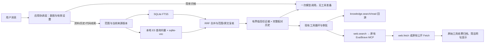

# 本地 RAG 与网页检索：当前实现

更新：2026-10-06。基于 `113d9e9` 的本轮工作区实现，尚未提交。本文描述已落地路径；远程向量数据库、答案缓存及自动语义记忆仍属后续方案。近期方法与 Agent 评测边界见 [优化记录](retrieval-optimization-20261006.md)。

## 用户入口

设置增加“检索与网页搜索 → 管理”，项目三点菜单增加“检索设置”。全局本地检索默认开启，嵌入默认 `builtin-multilingual`；工作设置可以继承全局或单独覆盖。挂载文件夹索引默认关闭，用户明确开启后才扫描普通文本与代码。资料可以显式导入为全局或工作快照、查看及移除，原文件不改动。

窗口支持最小化、最大化和关闭，修改自动保存并立即生效；使用 revision CAS，遇到冲突刷新，不重放旧操作。没有底部关闭按钮或“已保存”提示，中英文即时切换。后台索引不随窗口关闭而取消，提供进度及取消入口。

网页检索支持关闭/自动、现有 Exa/Brave 服务选择、标准/深入、语言与浏览器阅读策略配置。读取设置不会连接 MCP；未连接、未就绪的服务不能声称已可执行。搜索仍需要已配置服务及其真实依赖/认证，程序没有伪造离线搜索结果。

## 实际链路



普通问候不启动 MCP、ToolHost、SQLite 检索或嵌入推理，仍由用户选择的模型回复。资料充足且明确只问本地资料的请求不主动连接外部 MCP。模型本身的推理耗时仍由接口决定，不能保证所有服务都在固定秒数内返回。

已有正式会话、三协议、工具循环、工具与返回配对、256K 配置上限和上下文压缩继续使用；检索只占有界证据预算，不降低独立输出设置、不删除原始记录。

## 来源与隔离

允许范围由后端根据当前聊天推导为 `user`、当前 `project:<ID>`、当前 `chat:<ID>`。模型不能提供其他项目 ID 扩大范围。

- 已确认有效记忆使用原有记忆服务的来源状态，撤销或移动后不继续注入。
- 当前聊天索引已完成公开消息；不索引可见思考、工具私有元数据，也不把正在询问的消息当作证据。
- 同项目其他聊天只共享已确认工作记忆与明确工作资料，不自动共享原始对话。
- 导入资料是由用户选择的文本快照；修改原文件不默默改变该快照，应重新导入。
- 挂载文件夹仅在明确开启后索引；遵守 `.gitignore`，跳过凭据、链接、二进制、依赖和构建目录、正式 Data/扩展目录。

文件内容哈希、来源版本、绑定版本和范围在检索及读取时复核。移除的资料留下永久撤销身份，迟到后台任务不能复活；挂载变更只清理派生来源，允许有效重建。旧候选对账删除，避免占用 Top-K；不会删除原文件、聊天或记忆。

正文使用可读资料名或编号引用，`sourceRef` 长串只作工具参数。自动检索的实际命中片段、版本和哈希按聊天归档为 `RetrievalResultRef`，助手正式消息保存 `EvidenceReferences`；清索引后仍能核对当时实际使用的证据。尚未增加独立的引用点击器或轨迹查看窗口。

## 数据目录

```text
Data/
├─ Knowledge/
│  ├─ catalog.json                 权威资料登记，包含范围和移除状态
│  └─ 资料ID/source/document.txt    规范化文本快照
├─ Retrieval/
│  ├─ settings.json                全局检索配置
│  ├─ source-identities.json       稳定来源版本与永久撤销记录
│  └─ jobs.json                    持久后台索引状态
├─ Projects/项目ID/
│  ├─ retrieval.json               工作覆盖和挂载索引开关
│  ├─ Memory/                      既有确认记忆
│  └─ Sessions/聊天ID/
│     ├─ events.jsonl              既有正式聊天
│     └─ tool-results/             完整结果与当次检索证据
├─ Chats/聊天ID/                   普通聊天与同类结果
├─ Memory/                         用户确认记忆
└─ Index/
   ├─ search.sqlite                既有侧栏元数据索引
   └─ retrieval.sqlite             可重建 FTS/分块/向量索引
```

全局和工作资料在 `Knowledge` 中通过稳定 ID 与 scope 区分，不在挂载文件夹内写应用数据。迁移同时复制 `Knowledge`、`Retrieval` 及项目覆盖文件，逐文件校验；迁移前停止后台写入，完成 WAL checkpoint 并关闭 worker，最后切换指针。回滚同路径也会创建可用的新运行时。

## 资源与效率

SQLite FTS5 和 sqlite-vec 直接随 Node 网关使用，不要求用户安装数据库服务。默认多语言 `multilingual-e5-small` q8 固定版本，生成真实 384 维向量；权重、分词器和许可随包，worker 推理禁止网络，CPU 最多两线程。Node、ONNX 原生库和必要 Microsoft 可再分发运行库一起打包，构建机负责准备并校验资产，终端用户不需要 Python 或额外下载模型。

索引、分词和模型推理在 worker 内进行。前台请求更新词法索引，项目/导入资料的文档向量由后台任务处理；后台推理不占前台串行队列，只在短发布批次复核来源。200 条聊天的前台检索已用实际 JSONL 和阻塞中的后台嵌入验证，不保证任意体积的全部原文每轮进入模型。

词法支持中文二元词、中英混写及代码标识符；默认分块 384 字符并保存行号/偏移。词法版本 v2 保留文档词频，查询仍去重；旧索引分批重建派生词法，不改正式来源、偏移、向量或撤销状态。文档向量增加有界的真实标题/章节/路径上下文，版本与原始文本哈希分开记录；不生成虚构背景，也不改原文。

两通道各最多 40 个窄候选，先筛授权范围再 Top-K，取命中行完整正文；混合检索最多取 48 候选，经重复/重叠消除及 Jaccard MMR 最多选择 6 块。实际条数由完整证据和 token 预算决定，允许同文档的多段不同证据。回忆、普通资料、文件、研究的默认证据预算分别为 2048/4096/6144/8192 tokens，运行时再限制在实际输入窗口的 12% 内；已有实际上下文中的相同片段不重复注入。简单社交消息不准备工具，明确资料续问可保留原问题实体、补充上一资料请求，不新增改写模型调用。

原生向量是授权集合精确距离扫描；超过 50,000 块降级词法，不宣称 ANN。模型、向量库或部分块不可用时明确降级，不使用假向量。超过嵌入模型 512 token 的输入明确拒绝，失败块保持词法可用。设置可选择复杂查询离线重排；默认不加载，启用后对最多 20 个去重候选排序，错误保留混合结果。证据状态只描述可观察的支持范围，排序分数不等于真值概率，弱证据不会直接终止回答。

初版普通文本单文件不超过 2 MiB；单次树扫描最多 2,048 文本文件、20,000 目录项和 32 MiB。导入最多 512 文件；每个用户/工作资料范围最多 1,024 来源、32 MiB。超限明确报错，不把半份导入当作完整。挂载变更监听和短期缓存减少重复扫描，命中片段仍实时回源校验。

网页检索标准档限制 2 次查询、6 页、45 秒；深入档 12 次查询、20 页、180 秒。实际 Exa/Brave 和公开 Fetch 走同一预算，保留既有审批；审批等待不占网络时间，来源重复时返回停止建议。阶段限额只阻止继续检索，不中断代码任务或丢弃聊天。新工具显示“搜索网页/查找资料/读取资料”，直接展示来源网址，结束后仍只显示最终回复和总用时。

普通联网查询先用搜索与公开 HTTP 读取，不启动或附着用户本机浏览器。自动浏览器阅读只接受配置已明确隔离且无头的 Chrome/Playwright，或非本机回环远程 CDP 连接；可见独立浏览器、现有登录浏览器和无法验证启动方式的自定义配置需要当前用户明确的浏览器操作任务。此判定在连接发现、目录、按需加载与执行中一致；工具理由不能授权。纯“再次尝试”仅延续紧邻用户浏览器任务，新查询会清除这项意图。DNS 非公共地址仍被拒绝，提示仅在实际存在允许的后台工具时建议按需加载，否则根据已有证据说明阻碍。

内存来源快照遵守 `cache.memoryLimitBytes`，指纹缓存最多 8,192 项，另复用既有请求观察缓存。`diskLimitBytes` 已保留配置合同，尚未实现跨请求网页磁盘缓存或答案缓存。网页语言作为模型来源选择提示，并在支持的 Brave schema 中传入 `search_lang`；不强制改写查询或翻译来源。关闭自动浏览器阅读会过滤已知 Chrome/Playwright 的自动读取工具，用户明确要求的浏览器操作继续经过原有权限；它不是全机网络禁令。

模型证据引用使用 29 字符的 `ev1` 句柄；完整 `rag1`、来源哈希、版本与范围仍在本聊天的正式工具归档中。回读先核对正式助手回执、归档完整性与当前关系，再检查索引和来源新鲜度，支持重启；另一聊天不能借用句柄。旧 canonical 引用继续可用。仅模型视图精简重复机用身份字段，公开原始归档不变。

`knowledge.read` 保留 `page` 分页，并提供 `window` 邻近窗口和 `section` 章节读取。默认锚点来自引用分块；跨标题时返回有界窗口、章节导航及范围覆盖标记，避免只读到前一章。明确 `anchorOffset` 可定位到对应章节；原文、UTF-16 偏移和索引分块保持不变，单次模型回读最多 16,000 字符。

`knowledge.search` 和 `web.search` 可用 `gap` 说明缺少的事实。普通模型在原有规划轮核对实体、时间、范围及条件，有依据即回答；程序不把排序分数或词重合当作证据足够。追加本地检索普通请求最多 16 次、同缺口 4 次，研究请求为 48/8；重复成功查询复用前仍校验当前范围和版本，失败与空结果不缓存为已解决。返回 `sufficiency: not-evaluated`，额度耗尽仍保留回读、文件操作与测试。网页沿用原阶段预算，没有新增独立判定模型。

工具循环和历史视图先核验归档，再收缩同目标、范围和正文的重复读取，或已被明确新版本替代的读取。当前仅包含 `filesystem.read/stat` 和 `knowledge.read`；正式日志、调用结果配对、原生状态、执行回执及失败状态保持。仅在确实节省输入时应用，不按年龄删除。完整合同与本轮实验见 [优化记录](retrieval-optimization-20261006.md)。

当前实际原生向量打包链路验收针对 Windows x64。ARM64 原生向量与空白 Windows 安装器尚未验收；不将开发构建成功等同于正式安装验收。

## 接口及模块负责

| 入口 | 合同 |
|---|---|
| `/api/retrieval/settings` GET/PATCH | 全局配置；PATCH `{expectedRevision,patch}` |
| `/api/projects/:id/retrieval/settings` GET/PATCH | 工作覆盖、索引来源与实际 `effective` |
| `/api/retrieval/status` GET | 来源/分块数、向量诊断、嵌入状态及任务 |
| `/api/retrieval/providers` GET | 配置的服务、连接状态及实际选择；不连接服务 |
| `/api/retrieval/sources` GET/POST | 列表或显式文件/目录导入，返回后台 jobId |
| `/api/retrieval/sources/:id` DELETE | 移除资料，支持 expectedRevision |
| `/api/retrieval/index/rebuild` POST | 后台重建，可指定 projectId |
| `/api/retrieval/index/jobs/:id` GET | 持久状态 |
| `/api/retrieval/index/jobs/:id/cancel` POST | 取消后续工作，已提交结果不伪装撤销 |

`/health` 增加 `retrievalProtocol:1`。A 负责 `orchestration/retrieval` 组合与生命周期；B 负责检索窗口和简洁轨迹；C 负责 `models/retrieval` 与固定嵌入资产；D 负责 `tools/retrieval`、路径策略及 MCP 适配；E 负责 `data/retrieval`、权威资料登记、索引/配置与迁移合同。数据层不导入模型、工具或编排层。

## 验证入口

```powershell
node --test apps/model-gateway/tests/retrieval-*.test.mjs
dotnet run --project tests/retrieval-client-smoke/RetrievalClientSmoke.csproj -- --live
dotnet run --project tests/ui-language-smoke/UiLanguageSmoke.csproj
node tools/development/check-architecture.mjs
```

原生检索窗口测试位于 `tests/retrieval-ui-smoke`，工具展示定向测试位于 `tests/transcript-ui-smoke` 的 `--retrieval-tools-only`。包内实际模型与 VC 加载验证证据位于忽略提交的 `artifacts/verification/embedding-package/result.json`。本轮最终执行结果另记，不沿用此前历史测试数字。
