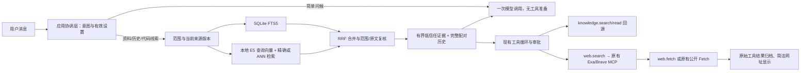

# 本地 RAG 与网页检索：当前实现

## 自动准备与模型取证的职责

用户提供资料及工作范围，主模型判断当前任务需要什么证据、哪里还有缺口；程序在已登记范围内完成解析、分块、词法索引、后台向量化和版本维护，不调用生成模型逐份批准文档。预备候选不替代模型对证据含义的判断，模型也不能通过取证计划扩大资料权限。

默认本地检索启用、语义模式 `auto`；挂载目录和正式资料导入均接纳后台任务，用户日常不需要操作是否向量化。设置中的停用与用户取消是明确的控制选择，系统不能偷偷恢复。模型提示要求在语义未就绪时继续词法搜索、原文读取和现有证据，不让用户每日管理索引或等待全库向量化。CPU/GPU 选择、批量、暂停和复用由现有资源与版本服务处理。

挂载目录持续监听并在启动时对账；正式导入维护资料快照，不擅自监听原文件所在的整个外部目录。单次工具读取与网页归档仍是任务材料，长期目录使用通过 `work.folder.bind` 登记。权限批准和长期记忆确认各有独立合同，不把自动索引解释成审批绕过、全盘扫描或无条件写入全局记忆。

2026-10-10 后端验收修复：有效 `local.enabled:false` 时，项目设置 PATCH 只持久化配置，不接纳来源重建；重建执行入口也在来源快照、目录读取、解码和资源接纳之前再次检查停用。默认自动准备仍启用。已开始的并发工作继续受取消及发布前配置/版本校验约束，设置保存不能撤销此前已经发生的 I/O。

`work.folder.bind` 保存目录后等待后台任务的接纳元信息，不等待来源解析或向量完成。回执的 `preparationState` 为 `scheduled`（已接纳，带 `preparationJobId`）、`unchanged`（当前绑定没有新接纳）、`disabled`、`blocked`（例如持久用户取消）、`failed`；旧调用实现缺少回执时为 `pending`，没有检索服务时为 `unavailable`。`preparationReason` 提供停用、阻断或失败原因；兼容字段 `automaticPreparation` 仅在 scheduled/unchanged 为 true，不表示向量已就绪。同目录重复绑定和用户取消不会伪报 scheduled；更换目录会按新绑定接纳任务。当前轮次权限范围及正常审批合同保持。

## 2026-10-10：自然语言长期工作与目录关联

内置 `work.folder.bind` 让主模型根据用户的长期工作要求关联当前工作目录；系统提示区分长期使用与单次读取，不用关键词规则直接改目录。工具固定作用于当前聊天所属工作，不能填写其他工作 ID，也不创建、移动或复制项目文件。目录必须存在并通过真实路径、保护目录和既有 Ask/Smart/Full 审批检查；已有目录只应在用户要求替换时改变。

关联经正式 `ConversationStore` 队列和事务提交，只更新目录字段及目录修订号，不重写聊天。旧工作目录采用预期路径比较，防止覆盖并发修改；同一目录重复关联不重复提交元信息事务。提交后请求后台自动准备与文件监听，不等待向量化。当前轮次保留原不可变文件权限，自己成功关联不会把对话截断；本轮访问新目录使用绝对路径、用途说明与正常审批，下一轮以新目录作为默认范围。其他请求或界面的并发改目录仍使旧工具上下文失效。

桌面数据客户端在目录版本冲突时只进行一次受限合并：后台仅改变工作目录、其他元信息未变且用户没有竞争修改该目录时，可以保留新绑定并重试；新增/删除/移动聊天、排序、归档或竞争目录编辑仍返回冲突。晚到结果不覆盖用户等待期间的新目录值。B 的页面与布局未修改。

网关重启时重新核对挂载目录清单，扫描软件关闭期间的新增、修改、删除，复用未变来源和向量；已经取消、已归档、无挂载或明确停用本地检索的工作不自行恢复。准备任务共享有界调度，并非每个工作创建独立常驻进程。本次补充回归代码与静态检查，不运行测试、模型或真实目录索引验收。

## 2026-10-10：挂载工作自动准备资料

工作挂载目录后不再需要开启索引开关。新工作的默认配置启用自动准备，旧配置的 `mountedFolder.enabled:false` 兼容读取为自动准备；旧字段仍接受合法输入，但不能关闭工作的目录发现，也不能改写绑定版本。无挂载、已归档及无目录工作不触发挂载扫描；明确的本地检索停用、语义模式和资源额度仍生效。

网关完成自身存储初始化后，只读取正式工作绑定元信息，异步接纳后台任务，不加载聊天正文或等待全仓向量化。读取/保存正式目录时补充检查挂载变化，替换、移除和归档会清理旧监听及来源缓存。重复打开同一工作不反复新建作业；并发目录更新按版本合并，新快照不能被较早读取覆盖。资源调度、增量文件监听、前台直接搜索、来源版本校验与用户取消后的持久暂停继续沿用现有机制。

设置移除挂载索引复选框，日常不显示建立/重建索引按钮，只提示自动准备及实际任务状态。恢复入口仅在失败、部分完成或用户取消后显示；工作窗口仅展示和取消本工作的任务，避免新自动任务跨工作混用。旧 API 的显式重建入口保留为维护合同。临时外部文件读取、网页抓取不会因此扩展到整个磁盘或自动保存为全局资料。

本次新增和适配回归代码，但按用户之前要求不运行测试或模型评分；语法、架构、编译与差异检查结果以本轮实际输出为准。

## 2026-10-10：大型仓库衔接收尾（未重新运行验收）

本次保留统一 SQLite/FTS/向量底座，补齐入口、证据与资源执行之间的衔接，不另建 RAG。用户追加要求不运行测试后，仅继续源码修改和静态核对；历史成绩不能代表下面最终工作树已经通过验收。

- 前台词法发布不再调用嵌入模型的 token fitting。后台再按模型合同拟合和向量化；同文、同派生与同绑定的已拟合版本可复用，词法刷新不能清空正确的旧向量。
- 未建立索引时，`filesystem.search` 提供有界直接文本搜索和 `mode:path` 路径查找，`filesystem.read` 支持行范围。搜索页额度不再成为整个仓库的扫描终点；原文读取与权限、忽略规则、覆盖说明独立于向量完成状态。具体合同见 [工具说明](agent-tools.md#2026-10-10大型仓库的直接文件入口)。
- 自动证据最终投影和显式搜索的实际工具预览中，完整原文块须与 canonical 引用、来源版本和 chunk SHA-256 一致，才登记为已提供原文。导航、摘要、被裁剪未发送的归档内容不计入。`knowledge.assess` 可以引用这些已提供原文；存在引文仍不证明结论语义正确。
- 重复读取按来源、版本、范围与内容识别，改变理由、查询措辞、归档 ID 或排序分数不算新增信息。`knowledge.read` 返回准确的 UTF-16 下一页入口；章节结束但后面还有正文时也能继续。文件版本变化后的重读仍有效，后台任务轮询不纳入这种原文重复判断。
- 空闲 CPU/GPU E5 可以在原生空闲确认后回收，默认保温两分钟。前台容量申请被拒绝时，只有确认自有闲置模型释放完成，才用相同额度重新准入一次；不重放实际操作、不卸载用户自行启动的模型。新后台申请有界让路两秒，再进入原有公平队列。恢复诊断分开保存前后系统可用量、预约账与释放事件，不把预约字节冒称物理释放字节。
- 修改目标在测试前、测试后、证据评估前与最终答复前重新核对绑定和哈希。仅覆盖本请求已授权派发的最多 64 个文件工具目标，单目标最多 1 MiB；目录、未知目标、超额或不可读目标不能冒充全仓版本验证。实际 exit、失败摘要、完整结果引用和观察版本分别保存。宿主副作用未知与取消继续保留未确认状态。
- 六题入口由全量语义完成改为当前动作能力准入；准备态仍可直接读工作区。缓存复用同时允许有界真实增量嵌入，默认最多 1,024 块，可显式配置。评分快照增加适配器与评分版本，旧结果不能与新口径混算。

索引内单个来源仍有 `MAX_SOURCE_CHARACTERS`（2 Mi UTF-16 单元）保护，大物理文件由窗口来源表示；回读 schema 与实现统一引用这个合同，本次没有把物理文件上限误当成单页读取额度。语言服务全量调用图、全仓原子快照与大型任务完成率不由这些源码改动自动证明。现有候选档位继续保留，不机械降回 40。

2026-10-10 增补：[资源与记忆收尾](resource-memory-closeout-20261010.md)修复小窗口证据扣空、上游 32 块组批、重排实际额度、覆盖报告校验及记忆派发前的新鲜度。自动证据按真实余量使用 20%/30%/35%起始份额，研究最高 32K；内部候选与最终引用分开。PDF 页窗口、Windows 原生 OCR、确认记忆的选择性索引及有界准备流水线已经接线；原始文件与窗口额度仍有效，覆盖和设备未知状态如实报告。以下历史验证不代表本次成绩。

更新：2026-10-09。前三阶段提交于 `1e7062a`；随后补入原生进程隔离、实际 tokenizer 分块、更多语法及文档提取。当前沿用证据缺口规划、范围内 BM25、任务索引优先级与 Rust 资源预约，补齐 PR #3 的意图、预算和恢复链路。本文描述已落地路径；语言服务引用枚举、远程向量数据库、答案缓存及自动语义记忆仍属后续方案。近期方法与 Agent 评测边界见 [优化记录](retrieval-optimization-20261006.md)，此前短测见 [加固记录](retrieval-hardening-20261008.md)，本次变更与实际验收见 [收敛修复记录](agent-hardening-20261009.md)。

## 统一证据与资源执行

2026-10-09 补入[任务上下文与检索线索改造](agent-context-redesign-20261009.md)：原话与派生查询分离，历史补充不生成当前硬目标；自然语言领域只通过 `preferredDomain` 参与排序，自动搜索保持授权领域并集。工具和证据候选排序后交主模型选择，任务关系控制旧线索继承，最终回执区分来源变化、覆盖不足、去重和预算用尽。论文及成熟 Agent 的实际读取范围见[资料审计](agent-context-source-review-20261009.md)。

- `query-plan.planEvidenceAcquisition` 根据实际目标、候选、缺少的角色、模型状态和剩余预算选择词法/结构/向量、回源、可选重排或诚实说明缺口。相关性、词面覆盖、读取完成和任务正确性保持分离，状态仍为 `sufficiency: not-evaluated`，没有伪装成已验收的语义裁判模型。
- 自动上下文准备不启动冷嵌入模型；精确符号/文件命中复核当前来源后可省略向量推理。模型显式搜索仍能启动可用模型。部分索引明确提供覆盖诊断，提示使用已授权文件搜索/读取；不从空 Top-K 断言整个仓库不存在内容。
- 后台索引在批次边界响应任务路径优先级，只重排剩余已授权来源，进度记录实际批次身份；完成批次、检查点和明确取消语义保留。
- `data/retrieval/scoped-lexical-rank.mjs` 复用一份 FTS5 倒排索引，BM25 的文档数、平均长度和词频限定在当前 scope/领域；独立词法代次避免语义向量发布反复失效统计缓存。冷范围统计仍有扫描成本，未宣称百万规模延迟。
- 模型证据投影移除内部绝对路径/绝对标题及相关错误定位，原文正文、正式归档和本地 API 保持完整。模型结果回读先完整投影再分页；引用与回读偏移标明 UTF-16 单元，过期引用需要重新检索，不能复用旧 offset。
- `apps/resource-service` 为 A 负责的 Rust 私有 JSONL 子进程，采样系统资源并统一发放有限、有期限的 CPU/RAM/VRAM 预约；`platform/resources/resource-client.mjs` 管进程、IPC 和故障降级。C 的 `models/retrieval/inference-resources.mjs` 描述模型需求并消耗批准额度。CPU、驻留内存、GPU 分开预约，调用方取消不提前释放仍运行的原生任务，实际退出后才回收。
- Windows NVIDIA 传感器、执行设备映射与模型 GPU 后端验证是三个独立检查；未知设备或失败后端明确回退。模型使用固定原权重、分词、池化、归一化和向量空间；不能仅因显卡存在就改变模型精度或宣称 GPU 可用。
- Agent `ToolRun.verification` 可记录直接测试/构建命令的实际退出回执与文件工具变更代次；后续修改会标记旧验证不覆盖新变更。它不是任务成功证书，不分类复合 shell 脚本，不用源码命中或模型宣称填充通过结果。

同一资源权威已接通离线 E5/重排、ANN 原生所有者、结构解析、文档解码、检索请求、模型请求、MCP 执行和本机/沙箱/桌面执行器。Data worker 通过私有桥转交主网关预约，不产生第二份预算；原生任务实际结束后释放，未知退出保持隔离。反馈采用有界吞吐/延迟历史，前台优先与后台老化公平准入，线程与批次在安全边界调整。自有进程登记启动身份、RSS 和观测峰值；线程共享的 PID 去重。外部已运行的 Ollama/Qwen 服务不归本网关所有，不能强制管理其模型驻留或把全局显存遥测算作它的任务预算。多 GPU、AMD/Intel、磁盘/温度和长期压力仍需后续验收。

`knowledge.relations` 返回版本绑定的结构包含/声明/章节边与明确不确定的文本引用，不是语言服务引用穷举。`knowledge.assess` 要求当前引用的原文已回读或已经完整提供给模型、引文确实出现在原文、缺口/冲突已说明；未完成验证或更新的失败回执会阻止 ready 状态。该状态仍不证明引文蕴含结论。聊天经验保存在 `Retrieval/Experiences/<scope-hash>.json`，只可在原聊天复用且重新复核来源版本，不能作为当前答案或自动提升到项目/全局记忆。

### 当前预算与容量

自动注入的证据与候选检索额度分开计算。普通/文件/研究任务使用输入窗口的 20% / 30% / 35% 起始份额，分别最多 8,192 / 16,384 / 32,768 tokens；小窗口尝试提供至少 1,024 的可读或导航预算，但最终不得超过实际可用输入。工具 schema 相应上限为 40% / 30% / 20%，最多 24,000 tokens。它们是策略额度，最终仍扣除当前历史、系统指导、工具声明和安全余量。设备状态任务按实际必要工具 schema 校验小窗口兼容性，原因写入审计，不把百分比当作工具必须消失的依据。

`ContextAssembly.budgetAudit` 及检索 `budgetAudit` 分别保留配置、请求、资源建议、批准、下游限制、实际数量与提前裁剪原因。64/128 候选使用内部身份；最终选入当前模型视图后才分配 `e1` 等短引用，不把候选池压至 60。过大的候选可被略过后继续考虑其后证据；投影省略后重新编号，预算使用同一短引用格式。无关或重复材料不会为了用满额度而注入。

词法 SQL 使用 `fts_matches AS MATERIALIZED`，先执行一次 FTS 匹配，再关联当前 scope/领域的 BM25 统计。`RetrievalIndex.search({ timeoutMs })` 默认 15,000 ms，可显式设为 1～120,000 ms。初始化结束后的纯只读阶段、且队列没有写入或向量搜索时，可确认 worker 退出后返回 `RETRIEVAL_SEARCH_TIMEOUT` 并释放预约；涉及写入、ANN 子进程或初始化时只发取消，等待实际回执。当前 SQLite 绑定没有 progress handler，因此这些情形不承诺硬实时中断，也不重放未知提交。

`local.rerankCandidates` 默认 20，可选 20/40/60；显式 `null` 使用资源建议。重排只改变前缀排序，未重排的尾部仍参与候选选择。精确路径/符号或不需要语义判别的任务可以跳过。ANN 阈值、expansion 与缓存已有后端设置，本次不以未经对照的更大常量替换它们。

推理诊断区分请求线程、批准线程、实际会话配置和后端回退原因；配置线程不冒充实测物理线程数。长度相近的输入组成推理批次，单条超过批准 token 预算也会拒绝；批准额度、padding 和有界热态吞吐反馈共同限制批量。仅记录本轮真实执行后端，不依据“机器有 GPU”声称 GPU 实际加速。

| 项目 | 当前行为 |
|---|---|
| 推理线程和批次 | CPU 请求按机器核心数计算、最多请求 32，实际使用批准线程；批量按 token/字节/内存和反馈计算，执行批量最多 128。默认单请求文档上限 512、队列 128、单请求 8 MiB、总排队 64 MiB，仍有背压 |
| 检索候选 | 无资源建议时普通每通道 64 / 融合 96，研究 128 / 160；资源建议可调整，通道最多 160、融合最多 192，独立于最终证据预算 |
| 模型证据 | 普通 16 段 / 8,192 tokens，文件 24 段 / 16,384，研究 40 段 / 32,768；硬件建议和剩余上下文可以收缩，工具显式证据预算最多 32,768 |
| ANN | 自适应内存预约，分片最多 1 GiB、缓存最多 16 片；同一授权范围的大集合分成不相交图，过期图取消/替换。独立原生建图最多四路、队列最多 64，仍受实际 CPU/RAM 预约约束 |
| 来源容量 | 默认 20,000 文件、512 MiB 总原文、32 MiB 单文件、200,000 扫描项；后端设置可配置至 100,000 文件、8 GiB 总量、256 MiB 单文件、2,000,000 扫描项 |
| 来源发布批次 | 默认请求 32，可配置 1～128；按实际正文/窗口长度与 SQLite 100 来源、8 Mi UTF-16 单元原子边界分批。小文件不再强制四份一批，未知正文仍按完整上限预留 |
| 大文件与文档 | 文本流式哈希与 128 Ki UTF-16 窗口，保留原字节和全局偏移。PDF/DOCX 默认输入 32 MiB，但提取正文仍限 2 MiB，PDF 100 页；不把所有大文档格式说成无限支持 |

这些是代码预算，不是已测性能指标。E5 的真实 512-token 输入边界、模型 API 上限、权限和哈希校验继续保留。GPU 增加两个可选 DirectML q8 配置：`builtin-multilingual-dml-q8` 和 `builtin-multilingual-reranker-dml-q8`，真实计算算子及 CPU 参考短测通过；与旧 CPU 配置使用独立身份，切换须建立兼容索引。小查询并不保证更快，也不静默给已有向量改标签。

本地短测与可执行五组 Agent 消融入口见[追加交付记录](retrieval-hardening-20261008.md#追加完成统一执行预算与独立任务评测)。本轮未运行真实云模型完整基准，未修改 B 界面，也未重启旧网关。

Rust 开发工具只用于构建；exe 和第三方许可证由打包白名单放入 `runtime/resource/`，发布缺少有效资源包会失败。用户安装包不要求安装 Rust、Python 或数据库服务；开发机缺少 Rust 时保留明确标识的 CPU 降级。B 的界面未改，也未新增资源监控显示。

### Windows 收尾策略与接口

本轮部署范围仅 Windows x64，未新增 Linux、macOS、ARM64 或多 GPU 适配。`embeddingDevicePolicy`
支持 `auto|cpu|gpu`，auto 首次建库只有在真实 GPU 映射和精确 profile 声明均成立时选 GPU；
已有 CPU 索引继续可用，后台构建 GPU 空间，覆盖当前来源后才切换。GPU 故障或暂时不可用时，
auto 复用当前兼容 CPU 空间，否则保留词法并报告缺口；显式 gpu 不以 CPU 投影冒充成功。
语义关闭不会自动迁移；空间不匹配仍拒绝，两个空间不是两套正式来源库。

最终回答前重新核对实际回读和自动引用的当前版本、授权范围与绑定；只反馈需要回读的来源，
最多两次定向修复，已成功操作不重放。仍无法核验时保留回复并说明具体不足，不标记事实已认证。
自动证据和工具证据均受策略、显式上限及真实剩余上下文约束，预留输出、系统、历史及工具声明；
剩余为零时不再启动索引/向量工作。问候不等待可选外部进程观察、工具发现或索引。

`/api/retrieval/status` 增加 `configuredEmbeddingProfileId`、`embeddingProfiles`、`resources`、
`vectorSpacePolicy`、`externalModels` 和 `deployment`。配置项与已加载后端分开，实际 CPU/DML/hybrid
以各 profile 的 `inferenceBackend` 为准；作业字段显示真实 queued/running/paused/partial/failed。
Shared DTO 保留这些字段及设备/容量设置，未指定的补丁字段不发送。B 的界面仍未接入这些新状态，
不能将合同完成写成 UI 已完成。24 项范围与本轮短测见[Windows 收尾记录](retrieval-hardening-20261008.md#本轮收尾windows-限定与24项核对)。

## 统一检索平台的第一阶段

第一阶段已完成派生版本、取消与资源所有权、窄职责接口及模型注册。沿用 Node.js JavaScript ESM、SQLite 和已有本地推理 worker，不引入 Python、独立数据库服务或第二套正式资料登记。该阶段新增八个产品模块，保留已有公开调用入口；不修改 B 的 WinUI/WebView2 页面、控件、样式、资源或客户端展示逻辑。

| 模块 | 实际职责 |
|---|---|
| `orchestration/retrieval/coordinator.mjs` | 组合服务、授权范围与当前来源复核、候选检索；拥有模型与索引资源的总生命周期 |
| `query-plan.mjs` | 问候/执行/资料路由、知识/代码/混合意图、检索操作与证据角色 |
| `evidence-service.mjs` | 不透明准备句柄、最终上下文装配、版本复核与一次正式证据归档 |
| `source-sync.mjs` | 正式来源快照缓存、挂载扫描、目录监听与变化通知 |
| `source-indexer.mjs` | 有界分块与嵌入、元信息一致检查、短批次发布及来源清理 |
| `index-job-service.mjs` | 作业去重、变化续扫、持久进度、取消确认与排空 |
| `source-manager.mjs` | 导入/移除事务、提交回执与上述来源组件的生命周期组合 |
| `data/retrieval/derivation-version.mjs` | 解析/分块/分词版本及实际嵌入输入签名 |
| `models/retrieval/model-registry.mjs` | 已实现的模型配置、固定运行资产、投影及向量空间身份 |

协调器从约 650 行缩为约 410 行；来源状态只由上述组件各自拥有，兼容字段引用同一份状态。SQL/FTS/向量仍由既有 `index-worker.mjs` 管理，派生规则由独立纯模块负责；没有建立只有转发作用的通用仓储或服务框架。

来源原文相同不再直接判定索引相同。派生签名同时包含解析器、分块器、词法 tokenizer、实际块身份/范围/行号和元信息；嵌入输入使用独立签名。仅兼容的词法刷新可以保留旧向量，块结构、解析、投影或声明的模型空间不兼容时失效。第一阶段 SQLite 专用索引 schema 升为 **2**；正式设置、资料登记和任务 JSON 的 schema 仍为 **1**。旧索引增量增加字段，保留 epoch、稳定 ID、撤销登记及旧引用，缺签名的旧行在下一次来源同步时重新派生。

新 `rag1` 引用可携带派生签名；同文重新解析后旧引用也会失效。最终证据发布用 `verifyReference` 只查索引元信息，不重读整篇或再次检索；短引用的模型投影隐藏签名。授权已检查、来源仍有效与结论已验证是三个不同状态，检索结果明确标记结论尚未验证。`coverage.complete: false` 表示候选搜索受预算限制，不能宣称已穷举函数引用。第一阶段仅建立代码/知识领域和定义/引用意图合同；下一节记录本轮已接入的 AST 定义检索，语言服务引用枚举与图查询仍未实现。

来源取消贯穿扫描、文件读取、登记、推理和发布；未提交操作可取消，已提交来源和已返回批次回执保留。索引期间导入新资料或挂载内容变化会触发再次扫描，普通重复重建仍去重；结束前封闭当前作业的追加入口，之后变化进入后继作业。取消和关闭不会继续下一轮扫描。每次调用的语义报告与作业持久化一致，分别记录 `complete / partial / unavailable / disabled`、有效向量与缓存数量及有限诊断码；词法索引完成不代表所有向量已就绪。第一阶段只记录中断；第三阶段增加纯索引作业的检查点恢复，不恢复或重放终端、文件编辑等副作用。

模型注册只包含现有离线 E5 嵌入和多语言重排两种实现。配置 ID、模型版本、输入投影、维数和固定运行资产共同确定向量空间；未知配置不会偷偷改用默认模型。批次身份不一致时保留词法检索、拒绝混合空间。`GET /api/retrieval/models` 提供实际注册清单，状态接口增加模型配置信息；均为后端兼容扩展，没有新增 UI。未来模型需要先实现并注册，清单存在不代表资产已验真或正在加载。

第一阶段未扩大原有容量和输入预算。第二阶段沿既有 SQLite 保存结构元信息，没有创建第二份正式资料库；第三阶段补入 ANN 与十万块组件验收。后续优化接入 Python/Go/Rust、真实 tokenizer 分块与有界 PDF/DOCX 文本提取；OCR、语言服务和单个百万块图验收仍属后续工作，见[问题与优化记录](retrieval-hardening-20261008.md)。

## 第二阶段：结构解析与专业检索

继续使用 **JavaScript ESM + SQLite**。新增四个产品模块，全部在已有 `data/retrieval` 内，不新增领域目录或独立进程服务：

| 模块 | 职责 |
|---|---|
| `code-structure.mjs` | 固定版本 Tree-sitter WASM 解析 C#、JavaScript/JSX、TypeScript、TSX、Python、Go、Rust 的真实声明和范围 |
| `document-structure.mjs` | Markdown 标题、段落、围栏代码、表格及纯文本段落解析；不宣称完整 CommonMark 实现 |
| `structure-worker.mjs` | 只接收已授权原文，串行解析和分块；不自行打开路径或启动解释器 |
| `structure-service.mjs` | 按需 worker、取消、超时、队列容量和派生缓存；关闭释放自己拥有的计算资源 |

固定 `@vscode/tree-sitter-wasm@0.3.1` 提供 WASM 运行时与 JS/TS、Python、Go、Rust 语法；C# 改用官方 `tree-sitter-c-sharp@0.23.5` 的 WASM，均为 MIT。新 C# grammar 支持集合表达式、主构造函数、record 和原始字符串，直接解析原文而不掩码或改写源码；其精确身份进入解析版本，旧派生缓存会失效。[运行时源码](https://github.com/microsoft/vscode-tree-sitter-wasm)、[C# grammar 版本](https://github.com/tree-sitter/tree-sitter-c-sharp/releases/tag/v0.23.5)。现有 Node 随包链路包含 WASM 和许可证，运行时不需要用户安装 Python、编译器或数据库服务。正式安装器/空白机器验收仍需另做。

代码按函数、方法、类、类型等真实语法声明切分，记录语言、符号、限定名、父符号、行号和完整声明范围。父类和外层函数保留头尾片段，嵌套声明单独索引；物理分块不重叠，完整声明回读可以覆盖整个父单元。超长单元按既有 384 字符预算细分，不扩大离线嵌入的 512-token 硬上限。结构标题只用于向量输入上下文，引用和编辑依据仍是原始文本与偏移。语法错误、未支持语言或解析不可用明确返回 `partial` / `unavailable` 和诊断，保留词法与原文回读；不伪造定义或向量。

文档按真实标题、章节路径、段落、表格和围栏代码组织；围栏内的 `#` 不生成假标题。Markdown 表格和长代码块也按预算细分，保留共同单元范围和原文。对话和记忆不因标题恰好以 `.cs` 结尾就被当成代码。导入快照保留可移植的文件名提示，语言识别不需要暴露原始绝对路径。

`knowledge.search` 兼容原参数，并可传 `domain: knowledge|code|mixed`、`symbol`、`path`。精确声明与文件路径候选在授权范围和领域筛选后生成，再与 FTS/向量融合；同时指定符号与文件时，真正交集在候选限额前优先，经过可选重排、同文去重和多样性筛选后仍优先。短 `Class.Method` 可以匹配限定名的完整后缀组件。结果给出结构元信息和实际通道计数，但定义只是已索引声明；`references:false`、`callGraph:false`、`complete:false` 继续明确能力边界。

`knowledge.read` 新增 `mode: unit`，根据已验证引用回读函数、类、段落、表格或代码块；过大单元按既有有界窗口分页，返回完整单元范围、当前覆盖和可继续使用的签名引用。旧资料无结构时明确 `unitUnavailable` 并退回窗口，不编造单元。`page` / `window` / `section` 仍兼容。所有模式继续检查聊天归属、正式回执、源版本、派生签名及撤销状态。

SQLite 派生索引升为 **schema 3**，正式资料、配置与任务 JSON 仍为 **schema 1**。旧索引补结构字段；原始资料和聊天不迁移到新数据库、不删除。同文解析或分块变化失效旧派生引用和不兼容向量。词法发布改变索引后失效语义缓存，恢复解析必须重新嵌入；只有正式回执确认未变化才可复用旧语义结果。

派生索引已增量升为 **schema 5**，保存真实 tokenizer 拟合后的完整正文范围、实际模型投影以及同一当前分块的最多两个向量空间；旧 schema 4 的向量在打开时迁入子表，不改变正式来源或引用。结构单元先按字符形成有界候选，再按完整实际输入的 512-token 预算细分，原文及声明范围不丢失。嵌入暂时不可用时不把未拟合数据缓存为成功，未变化的已授权源保留有效旧派生；真实原文或实际嵌入输入变化仍失效旧向量，恢复后可重试。正式资料、设置、任务 JSON 仍为 schema 1。

解析完整派生缓存最多 64 项 / 8 MiB；索引器另在原有最多 8,192 个指纹项中保留轻量版本回执，不保存第二份正文。原文、来源版本、解析规则和模型空间相同的已发布来源，在解析前直接跳过，避免超过完整缓存容量后每次重解析全库；不可用降级必须允许后续恢复。派发但已取消的请求仍计入 32 项容量，直到 worker 确认完成，防止密集取消绕过队列上限。原文读取、当前哈希与编辑前复核仍由既有流程执行。

本阶段不变更 B 的桌面界面，不扩大原有导入、扫描与向量规模限制，不新增 LSP、调用图、ANN 或完整崩溃恢复。它解决结构定位和按单元回读，尚不能据此宣称大型代码仓库跨文件重构已验收。

对解析预算耗尽的章节请求，回读明确标记 `sectionUnavailable` 并退回锚点窗口，不把未解析标题之后的内容错误归入最后一个已知章节。SQLite 向量距离若为 `null` 或非有限值，在向量候选限额前过滤并返回 `RETRIEVAL_VECTOR_DISTANCE_INVALID`，继续保留词法证据；无效向量不能虚增混合检索指标。

## 第三阶段：增量索引、可恢复作业与本地 ANN

继续采用 **JavaScript ESM + SQLite**。仅新增四个产品模块：`data/retrieval/source-manifest.mjs` 保存来源元信息清单；`ann-store.mjs` 管理有界图缓存、图文件与计算进程；`ann-worker.mjs` 执行固定 ANN 运算；`vector-search.mjs` 在授权范围内选择精确/近似检索。其余改动扩展既有来源、作业和设置模块，不新增正式聊天存储或通用框架。

### 来源扫描与前台同步

`librarySnapshot` / `mountedSnapshot` 返回轻量描述和按需读取函数，不预先把整库正文装进内存。挂载清单在配置 Data 内持久保存相对路径、内容哈希和文件状态；重启核对元信息，未变化文件复用哈希。监听到明确文件变化时只核对该文件；目录重命名、忽略规则、分支变化或未知事件重新对账。明确落在 Data 或其他排除根内的事件在通知前忽略，防止保存清单再次触发自身索引；路径边界检查不误排相似名称的相邻目录。监听不可用如实退回轮询，正常每 30 秒完整协调一次。首次扫描需要读取内容计算哈希，随后索引的按需加载可能再次读取；扫描和加载计数分别记录，不把初次读取量说成一次。

前台同步缓存最多 32 个语料版本，仅缓存来源身份和派生状态，不存第二份正文。缓存键包括当前授权范围、来源版本、绑定/设置/解析身份、索引 epoch 和范围 corpusGeneration；同一语料的重复查询跳过全库解析和逐来源核对。资料内容、派生规则、元身份及删除推进语料代次；单独补齐向量或更新聊天/记忆只推进既有索引 generation，不能造成整库正文重读。当前聊天消息与有效记忆仍每次同步，命中候选仍回源验证哈希。索引重建或范围变化不能复用旧缓存。索引器轻量指纹上限由 8,192 增到 64,000；完整解析缓存仍为 64 项 / 8 MiB。

### 持久作业

后台索引单路执行，项目作业仍分别登记和去重。原文派生与发布采用有界小批次，设置 `batchSize` 不会绕过单次 SQLite 文本发布上限。正式发布返回后才追加并同步检查点：记录源身份、内容/派生/嵌入签名、块数、向量空间与提交进度，不保存可执行命令。中途变化最多连续重新对账两次，持续变化以明确状态结束，已提交结果保留。

重启自动接续有有效检查点的纯索引作业，先核对当前设置、挂载绑定、SQLite 已发布记录和来源版本，再跳过已提交且未变化的来源；缺失或损坏的完成态缓存退回重新派生。优雅关闭将可恢复作业标记暂停；用户主动取消不自动恢复。截断的日志尾行可保留已验证前缀，中间损坏不能静默忽略。旧格式作业缺少检查点时继续如实记录中断。此机制只恢复索引，不等同于长任务 Agent 的命令重放或断点续跑。

### 向量后端与随包运行

固定依赖 **`usearch@2.26.4`，Apache-2.0**，采用本地 HNSW 图；[上游源码](https://github.com/unum-cloud/usearch)和 [Node API](https://unum-cloud.github.io/USearch/javascript/index.html)提供现成实现。SQLite 继续拥有元信息、原向量和来源版本，图是可重建派生缓存。分片按授权范围、模型配置、模型版本、向量空间、维数和领域划分，先隔离再 Top-K；绝不把全库未授权候选交给模型后过滤。

`local.ann.mode` 支持 `auto / off / ann / exact`：默认小集合精确扫描，单分片超过 50,000 块使用 ANN。关闭 ANN 保留原先精确扫描保护；显式精确对照默认有 1,000,000 块上限。图损坏、计算进程退出或内存预算不足时保留授权集合内的有界精确降级与诊断，不伪造语义成功。默认最多缓存 4 个图、每图估算预算 256 MiB，HNSW 参数为 connectivity 16、expansionAdd 128、expansionSearch 128；这不是整个进程 RSS 的硬上限。降低预算会释放旧计算进程再按新预算加载/降级，避免旧图继续占有资源。图与范围 generation、索引 epoch、参数和文件哈希绑定；删除及源更新在 SQLite 提交后同步失效/更新图。最多缓存 64 份 / 8 MiB 的分片计数元信息，每次仍读取当前 epoch 与授权范围 generation；缓存不含正文或向量。

Windows 原生库对 Unicode 文件名的限制由一个按需、隐藏、仅运行 ANN 操作的 Node 子进程适配：工作目录是应用管理的 `Data/Index/ann`，原生库只接收 ASCII 图文件名，Node 文件 API 处理中文完整路径。主网关不切换工作目录，不依赖短路径、固定盘符或用户安装 Python。进程由索引服务拥有，关闭时释放并等待退出；它没有终端或文件工具执行入口。随包规则收录固定 Windows x64 预编译模块及许可证；ARM64 和空白机器安装仍需单独验收。

### 容量配置与边界

全局/项目有效设置新增 `local.indexing` 与 `local.ann`，沿用已有 revision CAS 接口并按字段深度继承。没有修改 B 的 UI；新参数当前通过后端配置接口调整。默认挂载/每范围资料预算为 20,000 文件、512 MiB、200,000 目录项、单文件 2 MiB；文件数可调至 100,000，总体积至 8 GiB。降低预算后重新核对，超限报错并保留原资料。显式资料单次导入仍最多 512 文件，不能宣称一次可导入整个万文件资料目录。ANN 容量与查询预算是独立设置，增大来源预算不能保证所有向量常驻内存。

本阶段验收目标是 10,000 个物理源文件、100,000 个向量块的本地组件稳定性；它不证明百万块、语言服务引用、跨文件自动重构或实际模型回答质量。固定向量的精确/ANN 对照和真实来源扫描分开记录，完整模型任务成功率需后续固定模型与执行测试验收。

## 用户入口

设置增加“检索与网页搜索 → 管理”，项目三点菜单增加“检索设置”。全局本地检索默认开启，嵌入默认 `builtin-multilingual`；工作设置可以继承全局或单独覆盖。挂载文件夹索引默认关闭，用户明确开启后才扫描普通文本与代码。资料可以显式导入为全局或工作快照、查看及移除，原文件不改动。

窗口支持最小化、最大化和关闭，修改自动保存并立即生效；使用 revision CAS，遇到冲突刷新，不重放旧操作。没有底部关闭按钮或“已保存”提示，中英文即时切换。后台索引不随窗口关闭而取消，提供进度及取消入口。

网页检索支持关闭/自动、现有 Exa/Brave 服务选择、标准/深入、语言与浏览器阅读策略配置。读取设置不会连接 MCP；未连接、未就绪的服务不能声称已可执行。搜索仍需要已配置服务及其真实依赖/认证，程序没有伪造离线搜索结果。

## 实际链路



普通问候不启动 MCP、ToolHost、SQLite 检索或嵌入推理，仍由用户选择的模型回复。资料充足且明确只问本地资料的请求不主动连接外部 MCP。模型本身的推理耗时仍由接口决定，不能保证所有服务都在固定秒数内返回。

已有正式会话、三协议、工具循环、工具与返回配对、256K 配置上限和上下文压缩继续使用；检索只占有界证据预算，不降低独立输出设置、不删除原始记录。

## 来源与隔离

允许范围由后端根据当前聊天推导为 `user`、当前 `project:<ID>`、当前 `chat:<ID>`。模型不能提供其他项目 ID 扩大范围。

- 已确认有效记忆使用原有记忆服务的来源状态，撤销或移动后不继续注入。
- 当前聊天索引已完成公开消息；不索引可见思考、工具私有元数据，也不把正在询问的消息当作证据。
- 同项目其他聊天只共享已确认工作记忆与明确工作资料，不自动共享原始对话。
- 导入资料是由用户选择的文本快照；修改原文件不默默改变该快照，应重新导入。
- 挂载文件夹仅在明确开启后索引；遵守 `.gitignore`，跳过凭据、链接、二进制、依赖和构建目录、正式 Data/扩展目录。

文件内容哈希、来源版本、绑定版本和范围在检索及读取时复核。移除的资料留下永久撤销身份，迟到后台任务不能复活；挂载变更只清理派生来源，允许有效重建。旧候选对账删除，避免占用 Top-K；不会删除原文件、聊天或记忆。

正文使用可读资料名或编号引用，`sourceRef` 长串只作工具参数。自动检索的实际命中片段、版本和哈希按聊天归档为 `RetrievalResultRef`，助手正式消息保存 `EvidenceReferences`；清索引后仍能核对当时实际使用的证据。尚未增加独立的引用点击器或轨迹查看窗口。

## 数据目录

```text
Data/
├─ Knowledge/
│  ├─ catalog.json                 权威资料登记，包含范围和移除状态
│  └─ 资料ID/source/document.txt    规范化文本快照
├─ Retrieval/
│  ├─ settings.json                全局检索配置
│  ├─ source-identities.json       稳定来源版本与永久撤销记录
│  ├─ jobs.json                    持久后台索引状态
│  ├─ checkpoints/作业ID.jsonl     已提交批次的元信息回执
│  └─ SourceManifests/              挂载来源元信息清单
├─ Projects/项目ID/
│  ├─ retrieval.json               工作覆盖和挂载索引开关
│  ├─ Memory/                      既有确认记忆
│  └─ Sessions/聊天ID/
│     ├─ events.jsonl              既有正式聊天
│     └─ tool-results/             完整结果与当次检索证据
├─ Chats/聊天ID/                   普通聊天与同类结果
├─ Memory/                         用户确认记忆
└─ Index/
   ├─ search.sqlite                既有侧栏元数据索引
   ├─ retrieval.sqlite             可重建 FTS/分块/向量索引
   └─ ann/                         版本绑定的本地 HNSW 派生图
```

全局和工作资料在 `Knowledge` 中通过稳定 ID 与 scope 区分，不在挂载文件夹内写应用数据。迁移同时复制 `Knowledge`、`Retrieval` 及项目覆盖文件，逐文件校验；迁移前停止后台写入，完成 WAL checkpoint 并关闭 worker，最后切换指针。回滚同路径也会创建可用的新运行时。

## 资源与效率

SQLite FTS5 和 sqlite-vec 直接随 Node 网关使用，不要求用户安装数据库服务。默认多语言 `multilingual-e5-small` q8 固定版本，生成真实 384 维向量；权重、分词器和许可随包，独立模型进程禁止网络，每模型 CPU 最多两线程。Node、ONNX 原生库和必要 Microsoft 可再分发运行库一起打包，构建机负责准备并校验资产，终端用户不需要 Python 或额外下载模型。

SQLite/结构解析仍在 worker 内进行，嵌入/重排在各自独立 Node 进程内运行。前台同步小范围词法索引，大型冷语料交给持久后台作业，未完成目录发现不删除尚未发现的来源。后台推理不占前台串行队列，只在短发布批次复核来源；大图使用有界后台建图队列。200 条聊天的前台检索已有历史 JSONL 与阻塞嵌入验证，不保证任意体积的全部原文每轮进入模型。

词法支持中文二元词、中英混写及代码标识符；默认分块 384 字符并保存行号/偏移。词法版本 v2 保留文档词频，查询仍去重；旧索引分批重建派生词法，不改正式来源、偏移、向量或撤销状态。文档向量增加有界的真实标题/章节/路径上下文，版本与原始文本哈希分开记录；不生成虚构背景，也不改原文。

两通道各最多 40 个窄候选，先筛授权范围再 Top-K，取命中行完整正文；混合检索最多取 48 候选，经重复/重叠消除及 Jaccard MMR 最多选择 6 块。实际条数由完整证据和 token 预算决定，允许同文档的多段不同证据。回忆、普通资料、文件、研究的默认证据预算分别为 2048/4096/6144/8192 tokens，运行时再限制在实际输入窗口的 12% 内；已有实际上下文中的相同片段不重复注入。简单社交消息不准备工具，明确资料续问可保留原问题实体、补充上一资料请求，不新增改写模型调用。

原生向量按授权集合选择精确扫描或本地 ANN；第三阶段后不再因超过 50,000 块而整体关闭语义通道。模型、向量库或部分块不可用时明确降级，不使用假向量。超过嵌入模型 512 token 的输入明确拒绝，失败块保持词法可用。设置可选择复杂查询离线重排；默认不加载，启用后对最多 20 个去重候选排序，错误保留混合结果。证据状态只描述可观察的支持范围，排序分数不等于真值概率，弱证据不会直接终止回答。

初版的 2,048 文件扫描及每范围 1,024 来源 / 32 MiB 限额已由第三阶段可配置预算替代；单文件仍最多 2 MiB，单次导入仍最多 512 文件。超限明确报错，不把半份导入当作完整。挂载变更监听、持久清单和有界语料缓存减少重复扫描，命中片段仍实时回源校验。

网页检索标准档限制 2 次查询、6 页、45 秒；深入档 12 次查询、20 页、180 秒。实际 Exa/Brave 和公开 Fetch 走同一预算，保留既有审批；审批等待不占网络时间，来源重复时返回停止建议。阶段限额只阻止继续检索，不中断代码任务或丢弃聊天。新工具显示“搜索网页/查找资料/读取资料”，直接展示来源网址，结束后仍只显示最终回复和总用时。

普通联网查询先用搜索与公开 HTTP 读取，不启动或附着用户本机浏览器。自动浏览器阅读只接受配置已明确隔离且无头的 Chrome/Playwright，或非本机回环远程 CDP 连接；可见独立浏览器、现有登录浏览器和无法验证启动方式的自定义配置需要当前用户明确的浏览器操作任务。此判定在连接发现、目录、按需加载与执行中一致；工具理由不能授权。纯“再次尝试”仅延续紧邻用户浏览器任务，新查询会清除这项意图。DNS 非公共地址仍被拒绝，提示仅在实际存在允许的后台工具时建议按需加载，否则根据已有证据说明阻碍。

内存来源快照遵守 `cache.memoryLimitBytes`，指纹缓存最多 64,000 项，另复用既有请求观察缓存。`diskLimitBytes` 已保留配置合同，尚未实现跨请求网页磁盘缓存或答案缓存。网页语言作为模型来源选择提示，并在支持的 Brave schema 中传入 `search_lang`；不强制改写查询或翻译来源。关闭自动浏览器阅读会过滤已知 Chrome/Playwright 的自动读取工具，用户明确要求的浏览器操作继续经过原有权限；它不是全机网络禁令。

模型证据引用使用 29 字符的 `ev1` 句柄；完整 `rag1`、来源哈希、版本与范围仍在本聊天的正式工具归档中。回读先核对正式助手回执、归档完整性与当前关系，再检查索引和来源新鲜度，支持重启；另一聊天不能借用句柄。旧 canonical 引用继续可用。仅模型视图精简重复机用身份字段，公开原始归档不变。

`knowledge.read` 保留 `page` 分页，并提供 `window` 邻近窗口和 `section` 章节读取。默认锚点来自引用分块；跨标题时返回有界窗口、章节导航及范围覆盖标记，避免只读到前一章。明确 `anchorOffset` 可定位到对应章节；原文、UTF-16 偏移和索引分块保持不变，单次模型回读最多 16,000 字符。

`knowledge.search` 和 `web.search` 可用 `gap` 说明缺少的事实。普通模型在原有规划轮核对实体、时间、范围及条件，有依据即回答；程序不把排序分数或词重合当作证据足够。追加本地检索普通请求最多 16 次、同缺口 4 次，研究请求为 48/8；重复成功查询复用前仍校验当前范围和版本，失败与空结果不缓存为已解决。返回 `sufficiency: not-evaluated`，额度耗尽仍保留回读、文件操作与测试。网页沿用原阶段预算，没有新增独立判定模型。

工具循环和历史视图先核验归档，再收缩同目标、范围和正文的重复读取，或已被明确新版本替代的读取。当前仅包含 `filesystem.read/stat` 和 `knowledge.read`；正式日志、调用结果配对、原生状态、执行回执及失败状态保持。仅在确实节省输入时应用，不按年龄删除。完整合同与本轮实验见 [优化记录](retrieval-optimization-20261006.md)。

当前实际原生向量打包链路验收针对 Windows x64。ARM64 原生向量与空白 Windows 安装器尚未验收；不将开发构建成功等同于正式安装验收。

## 接口及模块负责

| 入口 | 合同 |
|---|---|
| `/api/retrieval/settings` GET/PATCH | 全局配置；PATCH `{expectedRevision,patch}` |
| `/api/projects/:id/retrieval/settings` GET/PATCH | 工作覆盖、索引来源与实际 `effective` |
| `/api/retrieval/status` GET | 来源/分块数、向量诊断、嵌入状态及任务 |
| `/api/retrieval/models` GET | 已实现的嵌入/重排 profile 及运行元信息；登记不表示资产已就绪 |
| `/api/retrieval/providers` GET | 配置的服务、连接状态及实际选择；不连接服务 |
| `/api/retrieval/sources` GET/POST | 列表或显式文件/目录导入，返回后台 jobId |
| `/api/retrieval/sources/:id` DELETE | 移除资料，支持 expectedRevision |
| `/api/retrieval/index/rebuild` POST | 后台重建，可指定 projectId |
| `/api/retrieval/index/jobs/:id` GET | 持久状态 |
| `/api/retrieval/index/jobs/:id/cancel` POST | 取消后续工作，已提交结果不伪装撤销 |

`/health` 增加 `retrievalProtocol:1`。A 负责 `orchestration/retrieval` 组合与生命周期；B 负责检索窗口和简洁轨迹；C 负责 `models/retrieval` 与固定嵌入资产；D 负责 `tools/retrieval`、路径策略及 MCP 适配；E 负责 `data/retrieval`、权威资料登记、索引/配置与迁移合同。数据层不导入模型、工具或编排层。

## 当前动作就绪与增量顺序（2026-10-10）

前台 `semantic:false` 只准备结构与词法索引，不申请嵌入 token fitting 或模型资源；后台语义作业独立完成真实 tokenizer 拟合和向量发布。前台遇到已发布且版本一致的拟合分块会保留它们，不用原始字符分块覆盖并删除已有向量。正文、解析器、模型空间与派生版本变化仍需重新验证，取消后的晚到结果不能发布。

明确路径已由协调器传入现有索引优先队列。任务目标和文件监听得到的最近变化各保留最多 16 条，互不挤占；仅在批次完成并正式发布的边界重排尚未处理的来源，顺序是任务目标、最近变化、原有基础文件偏好。优先级只重排已授权来源，不添加文件，不恢复已取消任务。监听继续以 800 ms 合并，未知文件名和周期对账不会伪造精确目标。

用户取消还会在既有 `jobs.json` 回执保存当前工作/绑定范围的 `automaticRebuildBlocked`，有效标记不随普通历史淘汰。文件变化、30 秒对账、普通查询、向量空间迁移和一般设置刷新继续记录变化与核验来源，但不能自动接续被取消的后台构建；返回明确的取消/暂停诊断，词法检索与授权文件读取继续可用。显式重建、重新导入或明确将对应索引关闭后重新开启才解除该停止策略。恢复新运行时也读取同一记录，不另建暂停数据库或 UI；用户更换实际挂载绑定属于新的作业范围。

已有来源生命周期继续保留：实际路径/挂载版本、内容哈希和发布前核验阻止过期覆盖；扫描不完整时不能把尚未访问的文件当成删除；单文件失败保留具体覆盖记录并允许其他来源继续。已删除文件在正式清理前仍可能留有派生存储，但新查询与回读必须通过当前来源核验，不能把旧记录当作有效证据。大文本采用既有窗口/PDF 分页与覆盖说明；CSV/JSON 尚不等同于流式数据库查询或完整表格计算引擎。

Windows 六任务适配器保留原题集与 fixture 身份，改为检查当前动作需要的文件/词法能力，不以全仓语义索引完成作为统一入场门槛。缓存继续优先复用，允许独立运行目录内有界真实增量嵌入（默认 1,024 个文档块，可显式配置），记录实际接纳数量和预算耗尽。自动证据只有在归档、有效来源版本和实际发送模型的文本三者匹配时才计作已收到；不再要求为计次数重复调用 read。来源引用、要求的原文、完整读取以及代码测试语义门槛仍分别验证。

适配版本为 `windows-six-action-readiness-v2`，评分版本为 `windows-six-received-evidence-v2`；历史得分不能未经适配说明直接与新版混合。按本次用户要求，后续修改仅进行静态检查，未重新执行六任务、真实模型或全套测试；更早完成的定向生命周期验证不能冒充本段新增接线的运行验收。

## 验证入口

```powershell
$retrievalTests = @(rg --files apps/model-gateway/tests | Where-Object { $_ -match 'retrieval-.*\.test\.mjs$' })
node --test --test-timeout=60000 --test-concurrency=4 @retrievalTests
dotnet run --project tests/retrieval-client-smoke/RetrievalClientSmoke.csproj -- --live
dotnet run --project tests/ui-language-smoke/UiLanguageSmoke.csproj
node tools/development/check-architecture.mjs
```

十万块规模测试是显式开启的组件验收，普通回归默认跳过；测试仅使用自有临时目录与合成向量：

```powershell
cd apps/model-gateway
$env:KYNXA_TEST_RETRIEVAL_SCALE = '1'
node --test tests/retrieval-scale.test.mjs
Remove-Item Env:KYNXA_TEST_RETRIEVAL_SCALE
```

原生检索窗口测试位于 `tests/retrieval-ui-smoke`，工具展示定向测试位于 `tests/transcript-ui-smoke` 的 `--retrieval-tools-only`。包内实际模型与 VC 加载验证证据位于忽略提交的 `artifacts/verification/embedding-package/result.json`。本轮最终执行结果另记，不沿用此前历史测试数字。

### 第一阶段本轮验证（2026-10-07）

- 完整网关回归：**971 通过、0 失败、1 项默认跳过**。默认跳过项为显式开启的原生重排验收；该文件另以本地真实资产执行，**4/4 通过**。
- 两项依赖真实交互桌面的检查未纳入上述完整回归；原生 `desktop_capabilities` 实测 `available: false`、`interactiveWindows: false`。这属于本轮环境受阻，不记为桌面操作验收通过，也未放宽原生桌面访问条件。
- C# 客户端连接真实临时网关：**18 项通过**，覆盖真实 SQLite 作业与来源快照；数据均位于测试自有临时目录。
- 架构扫描 **0 违规**；差异检查通过。`apps/desktop`、`apps/shared` 没有本轮改动，保留已有未提交修改。

网页超时回归改用 SDK 实际派发后的受控取消，避免把 30 毫秒准备期限抢先耗尽误判为已派发失败；仍核验失败归档和后续本地操作。模型维数/版本错配、导入提交后排队取消、运行中挂载设置变化均包含受控回归。完整执行记录位于忽略提交的 `artifacts/verification/rag-foundation-20261007`；本轮未提交、推送或重启当前应用和网关。

### 第二阶段本轮验证（2026-10-07）

- 最终完整网关回归：**1,025 通过、0 失败、1 项默认跳过**；默认跳过的真实离线重排验收另行执行 **4/4 通过**。未运行无关的真实可见终端用例，本轮实际桌面能力发现已通过。
- C# 客户端连接真实临时网关：**18 项通过**；覆盖实际 SQLite、后台作业及撤销，无云模型调用或真实用户聊天。真实离线 E5 验证中文查询能命中带结构标题的英文资料。
- 96 个来源再次同步：**新增解析 0 次**；改变来源、解析器版本/实例或模型空间仍会失效。频繁取消仍最多容纳 32 个未确认派发，迟到结果不入缓存。
- 固定 32 来源、12 查询的受控组件对比：原词法管线证据 Hit@1 / Hit@5 为 **8/12**，结构管线为 **12/12**。两组均关闭向量和回答模型；这是针对结构定位的自造回归，不能当成公开 RAG 基准、真实 Agent 成功率或竞品排名。实际延迟及各条证据排名在忽略提交的报告中保留。
- 架构检查 **0 违规**；差异检查通过。按实际打包规则求值，所需 8 项解析资源与许可证均包含；没有覆盖运行中的 AppX，未做新安装器或空白机器验收。

本轮执行记录：忽略提交的 `artifacts/verification/rag-structure-20261007/results.json` 与 TAP 文件。未修改 B 的 UI、未提交或推送、未重启当前软件或网关；当前运行包仍是第一阶段版本，第二阶段源码将在后续明确启动新版时加载。

### 第三阶段本轮验证（2026-10-07 至 2026-10-08）

- 最终完整网关回归：**1,076 通过、0 失败、0 取消、2 项默认跳过**。默认跳过为显式规模验收和原生离线重排；规模用例另行执行通过，原生重排本阶段未另行执行。真实可见终端用例不在本次检索验收范围。
- C# 客户端连接真实临时网关：**18 项通过**；覆盖实际 SQLite、来源登记与后台任务，不调用云模型或真实用户聊天。
- 真实 SQLite 恢复测试：已提交 2 个来源后暂停，重启只派生剩余 3 个；正常完成后重启也能复用检查点。用户取消保持终态，尚未开始的排队任务在前一任务仍挂起时即可持久取消；已运行任务仍排空自身回执。
- 前台同步测试：5 份资料首次加载 5 次；下一条聊天、记忆更新及纯向量追加均不增加整库加载，也不逐文件核对语料。资料删除、数据库重建及真实派生变化仍失效。消息/记忆的新增、修改、移除继续进入索引。
- 挂载测试覆盖持久清单、超过 2 秒的热快照、30 秒核对、增删改、预算收紧、监听不可用，以及真实 Windows 监听下 Data 内部清单写入不自激循环。
- 动态降低 ANN 内存预算/缓存数量时，测试确认旧原生计算进程已退出；正文和向量仍由 SQLite 保留。中文路径下图保存、重载、取消、损坏降级与范围/模型/领域隔离已覆盖。
- 按实际桌面依赖打包规则求值并复制所需文件，所需 **8 项运行入口/依赖/许可证全部收录**；用现有随包 **Node 24.14.0 / Windows x64** 实际加载预编译模块并执行搜索成功。未覆盖正在运行的 AppX，也未把此项当作空白机器安装验收。

10,000 个真实临时源文件、100,000 个 384 维向量块、32 个查询的受控对照，使用固定种子合成聚类向量及已知函数边界；不是嵌入模型质量、公开 RAG 基准或完整 Agent 任务评分。默认 HNSW 参数下的实际记录如下：

| 指标 | 本轮测量 |
|---|---:|
| ANN 相对同范围精确检索 Recall@20 | 100%，单查询最低亦为 100% |
| 精确检索热查询 P50 / P95 | 1,046.7 / 1,119.2 ms |
| ANN 热查询 P50 / P95 | 2.85 / 3.47 ms |
| 首次 ANN 建图及查询 | 29.08 秒 |
| 重启加载图及查询 | 1.19 秒，实际加载而非重建 |
| 来源首次扫描 / 重启元信息核对 | 31.99 / 14.28 秒 |
| 重启正文读取量 | 0 个文件，复用 10,000 个哈希 |
| 单文件变化核对 | 128.2 ms，仅读取 1 个文件 |
| SQLite 与图等派生磁盘体积 | 约 626 MiB |
| 父 Node 进程采样 RSS 峰值 | 约 425 MiB |
| ANN 子进程操作后观察到的 RSS 最高值 | 约 244 MiB |

机器为 i5-13450HX、16 逻辑 CPU、约 16 GiB 内存、Windows x64。磁盘体积含原向量与文本；发布约 37.67 秒含测试向量构造、物理文件写入和 SQLite 提交，不包含真实模型嵌入。父进程每 25 ms 采样，子进程操作后观察；两者不是同一时刻的总峰值。热查询不含来源首次核对、查询嵌入、重排或答案生成，不能用 3.47 ms 宣称整个 Agent 已在此时间完成。

本轮最终记录位于忽略提交的 `artifacts/verification/rag-scale-20261007/results.json`、`scale-benchmark.json` 和 `gateway-final.tap`。架构与差异检查通过；未修改 B 的界面、未提交或推送、未重启运行中的软件和网关。本阶段源码将在后续明确启动新版时加载。百万块、语言服务引用/调用图与真实跨文件修改任务仍需下一阶段独立验收。
