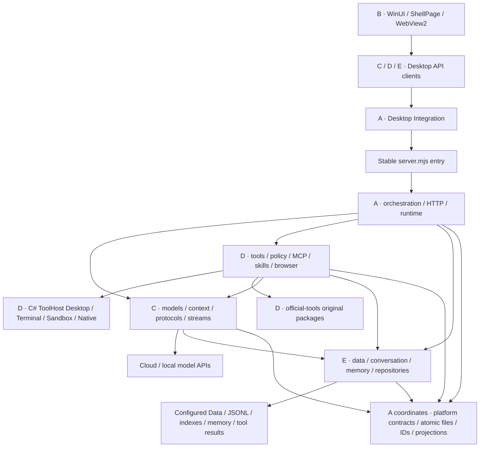

# 五人模块边界与源码参考

更新日期：2026-10-05。已提交基线 `5637dc3`；以下为本轮工作区重组，实际验证/提交由交付记录确认。[团队入口](../team/README.md)。

## 实际调用链

图展示主要调用方向；客户端通过共享 Chat/Tools/Memory DTO 通信。正式链路包括已经存在的 C# ToolHost，不新增第二份正式会话服务，也不将设计中的 Rust Authority 作为当前链路。

桌面 Services 子目录保留原程序集、命名空间和公开类型；既有客户端对 UiText 等展示类型的引用仍存在。全部 ShellPage partial 共享页面状态，由 B 唯一主责；目录重组不代表完整 MVVM 或跨程序集隔离。

## 主责目录

| 区域 | 主责 | 内容 |
|---|---|---|
| gateway orchestration | A | runtime、tool-loop、tool-run、server 实现、agent-http-routes 工具设置 HTTP 接线与 http-transport，组合及生命周期 |
| gateway models | C | 模型连接/发现、供应商与工具协议、流式、能力、output、context/history 投影 |
| gateway tools | D | 工具注册/发现、策略审批、MCP/Skill、浏览器、执行器和能力配置 |
| gateway data | E | conversation/memory/index、路径/迁移、sandbox-workspaces、tool-result-store |
| gateway platform | A 协调 | 原子 JSON、ID 校验、assistant-segments、model-transcript、reply-timing、tool-paths、tool-excerpts 等跨模块基础 |
| gateway official-tools | D | 保持包原目录；自有 Tools/catalog.mjs 导入调整，第三方技能原文和许可证未改 |
| desktop Services/Integration | A | 网关启动/生命周期、通信与错误基础 |
| desktop Services/Presentation 及 Views/Controls/资源 | B | 展示、交互、本地化与页面接线 |
| desktop Services/Models；shared Chat | C | 模型/聊天 API、SSE、聊天 DTO |
| desktop Services/Tools；shared Tools | D | 能力配置 API 与工具 DTO |
| desktop Services/Data；shared Memory | E | 会话/记忆 API、路径迁移与记忆 DTO |
| tool-host Desktop/Terminal/Sandbox/Native | D | 原生执行；根入口/csproj/构建与打包由 A 协调 |

gateway、desktop、shared、tool-host 分别在 apps/model-gateway、apps/desktop、apps/shared、apps/tool-host。根 server.mjs、initialize-storage.mjs、migrate-storage.mjs 保留 CLI 和导出入口，实现下沉；检查调用端和 smoke 的 Compile Include，不擅改参数、公开字段或资源语义。

## 依赖与共享变更

Models、Tools、Data、Platform 不引用 Orchestration。Data 只依赖自身与 Platform，Platform 不引用业务区域。Orchestration 组合专业服务，不由下层引用全局 runtime 掩盖循环。

原先 ConversationStore 从模型 store 取得 atomicJson/readJson，工具服务从 conversations 取得 validateId：纯基础下沉 Platform，避免 E 依赖 C 和 D 依赖 E 仓储。当前 models/model-history.mjs 仍从 data/tool-result-store.mjs 导入 publicToolResult 与元数据限额，使用公开结果预览；Tools 的 tool-catalog 等仍引用 Models 的纯预算/协议辅助，并读取 Data 的结果归档及工作区服务。这些有向依赖保留，不宣称所有域无交叉引用；不得让 Data/Platform 反向依赖模型、工具或编排。platform 只收真正共用合同/基础，不成为业务杂物箱。

Chat/Tools/Memory 分别由 C/D/E 主责，A 协调版本。跨端改动先列出字段、身份、错误、旧数据默认值和双方调用方，再同步实现、验证与说明。Platform 专业规则联系对应成员核对。跨目录协作注明文件归属，保留已有改动；不使用虚构账号 CODEOWNERS，不增加普通可逆修改审批。

## 当前成果与后续能力

工具设置 HTTP 接线已放入 orchestration/agent-http-routes.mjs，由 A 调用 D 的业务服务，避免 Tools 反向依赖 Orchestration 形成域循环。目录和纯基础函数提取已落实，用于五人实际开发交接；正式数据仍由单网关写入。稳定 ID、JSONL 原文、catalog 权威、会话队列、确认记忆范围与 expectedRevision 保留。请求上下文、UI 阶段收束、结果预览是投影，不删除正式事实。

已实现流式、工具循环、请求权限快照、审批、回执、MCP/Skill、浏览器与 ToolHost。隔离范围以 [工具架构](agent-tools.md) 为准。会话保存、取消与回执不等于持久长任务恢复；检查点、崩溃后动作核实、幂等重试和验证版本绑定另立合同与端到端验收。本轮不预填测试数字或承诺排期。

## 一手源码证据

以下路径核查于 2026-10-05；上游快速变化，使用前重新核对。本轮借鉴职责边界，没有复制第三方源码。

| 项目 | 源码路径证据 | KYNXA 采用的经验 |
|---|---|---|
| DeepSeek Harness | [architecture](https://github.com/deepseek-ai/deepseek-harness/blob/master/docs/architecture.md)、[agent-loop package](https://github.com/deepseek-ai/deepseek-harness/blob/master/packages/core/agent-loop/package.json)；本地源码已读 | agent 接口、loop 实现、tools、llm、session persistence 分开；持久事件与实时投影分开；五人团队不照搬 Cordis 和大量 package |
| pi | [agent-loop](https://github.com/earendil-works/pi/blob/main/packages/agent/src/agent-loop.ts)、[types](https://github.com/earendil-works/pi/blob/main/packages/agent/src/types.ts) | StreamFn 注入、context transform 与模型转换、工具执行钩子分开；旧 badlogic/pi-mono 已重定向 |
| OpenCode | [processor](https://github.com/anomalyco/opencode/blob/dev/packages/opencode/src/session/processor.ts)、[llm](https://github.com/anomalyco/opencode/blob/dev/packages/opencode/src/session/llm.ts)、[tool registry](https://github.com/anomalyco/opencode/blob/dev/packages/opencode/src/tool/registry.ts) | 轮次处理、请求和注册有入口；registry 仍依赖 Session/Provider，不宣称上游完全解耦 |
| OpenClaw | [embedded runner](https://github.com/openclaw/openclaw/blob/main/src/agents/embedded-agent-runner/run.ts)、[plugin loader](https://github.com/openclaw/openclaw/blob/main/src/plugins/loader.ts) | 稳定入口与内部 orchestrator/loader 实现分开；旧 pi-embedded-runner 和 plugin-sdk/index 路径不作当前证据 |
| Codex | [core](https://github.com/openai/codex/blob/main/codex-rs/core/src/lib.rs)、[tool router](https://github.com/openai/codex/blob/main/codex-rs/core/src/tools/router.rs)、[protocol](https://github.com/openai/codex/blob/main/codex-rs/protocol/src/protocol.rs) | 核心/协议/工具合同分开，保持身份与回执；Rust 源码不构成 KYNXA 换语言理由 |

DeepSeek 本地 LICENSE 为 MIT；[pi](https://github.com/earendil-works/pi/blob/main/LICENSE)、[OpenCode](https://github.com/anomalyco/opencode/blob/dev/LICENSE)、[OpenClaw](https://github.com/openclaw/openclaw/blob/main/LICENSE) 为 MIT；[Codex](https://github.com/openai/codex/blob/main/LICENSE) 为 Apache-2.0。后续若复制代码，核对具体文件/依赖并保留对应声明。Claude 私有内部实现没有本轮可核查源码，不作为内部架构证据。
